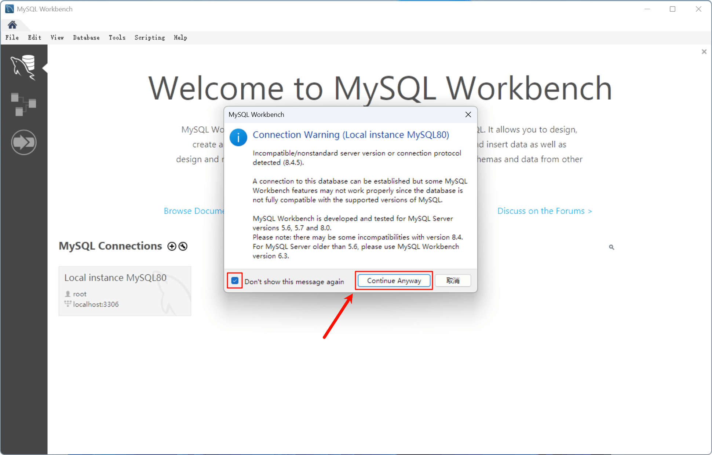
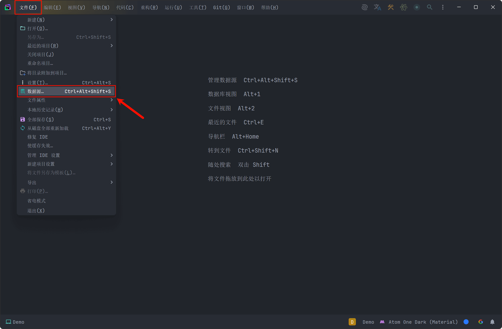
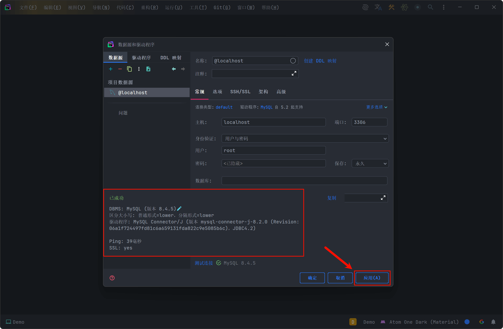
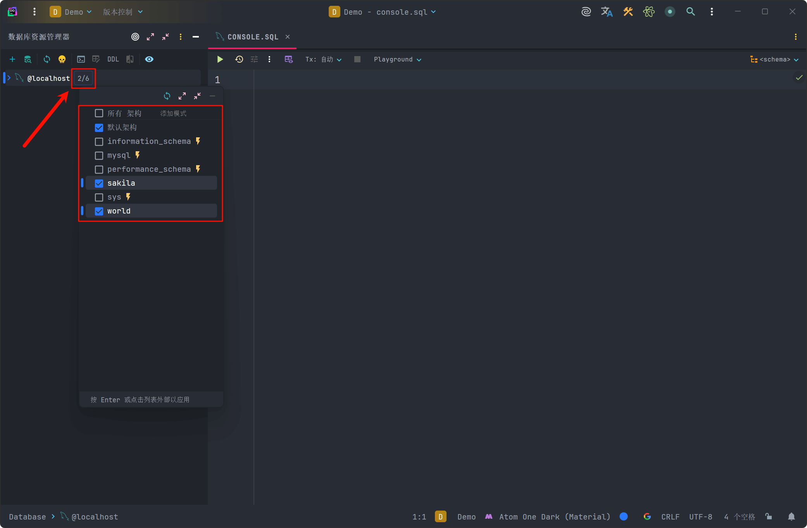

# SQL IDE 安装
> 作者：覃修交，原文来源：[Obelisk Docs：安装 SQL IDE](https://obelus.cc/guide/mysql/ide/)，本文按课程规范整理并补充注意事项。

!!! abstract "SQL IDE"

    SQL IDE 是用于编写、管理和优化 SQL 语句的集成工具，提供代码编辑、执行调试、数据浏览等功能。相比基础命令行终端工具，IDE
    通过可视化界面和辅助功能简化数据库操作，支持多种数据库类型，帮助开发者更高效地完成日常查询、表结构修改和数据维护工作。

    !!! note ""

        目前市面上可供选择的 SQL IDE 众多且各有各的特点功能，以下仅介绍五款适用于 MySQL 的热门免费 IDE

---

## 推荐 SQL IDE

### MySQL Workbench

!!! info "MySQL Workbench"

    **MySQL Workbench** 是 Oracle 公司于 2005 年推出的官方数据库集成开发环境，作为 MySQL GUI Tools 的继任者，现已成为
    MySQL 生态中最权威的管理工具。它采用 C++/Python 混合开发，提供完整的数据库生命周期管理功能，包括可视化 ER
    建模、SQL 开发调试、数据库迁移向导（支持从 SQL Server/Oracle 迁移至 MySQL）、性能优化仪表盘以及 MySQL
    服务器配置管理。在新版本（8.0+）已支持 NoSQL 文档存储功能。

    

    -   :material-thumb-up: __优点__

        ---

        - **深度集成**：原生支持 MySQL 所有特性，包括最新版本的功能预览
        - **专业建模工具**：提供逆向/正向工程，支持物理/逻辑模型转换
        - **可视化诊断**：内置 EXPLAIN 可视化工具和性能仪表盘
        - **跨平台一致性**：三大操作系统功能完全一致
    
    -   :material-thumb-down: __缺点__

        ---
    
        - **单数据库支持**：仅限于 MySQL 数据库
        - **不支持本地化**：不支持中文语言（可以安装汉化）
        - **性能问题**：处理大型数据库时可能卡顿

    

!!! warning "暂不完全兼容 MySQL 8.4.x [^1]"

    目前 MySQL Workbench 8.0.x 版本针对于 MySQL Server 8.0 版本开发和测试，虽然能连接 MySQL Server 8.4
    及更高版本，但某些功能在这些新服务器版本上可能无法使用。

!!! quote ""

    :material-home-circle-outline:{ .lg .middle } **官方网站**：<https://www.mysql.com/products/workbench>

---

### DataGrip

!!! info "DataGrip"

    **DataGrip** 是 JetBrains 公司 2014 年推出的专业级数据库 IDE，基于 IntelliJ 平台构建，与家族其他 IDE
    共享相同的代码分析引擎。其核心优势在于智能上下文感知系统：能自动识别 SQL 方言差异（如 MySQL 的 LIMIT 与 Oracle的
    ROWNUM），支持跨数据库重构（重命名表/列时自动更新关联视图和存储过程），提供可视化查询计划解释器，并内置
    CSV/Excel 数据导入导出工具。企业版还支持数据库版本控制集成（Git/SVN）。
    
    

    
    -   :material-thumb-up: __优点__
    
        ---

        - **多数据库支持**：可同时管理异构数据库（如 Oracle + PostgreSQL 联查）
        - **智能编码**：上下文感知的 SQL 补全，支持方言自动识别
        - **版本控制**：深度集成 Git，支持 SQL 脚本差异比对
        - **可扩展性**：支持 Python/JavaScript 插件开发
        
    -   :material-thumb-down: __缺点__
    
        ---
        
        - **资源占用高**：对硬件要求较高（4GB+ 内存）
        - **启动速度**：初次加载项目较慢
        - **学习曲线**：功能复杂，需时间熟悉
    
    

!!! tip "通过学生认证免费使用"

    DataGrip 本身为**付费订阅制**，但通过**学生认证**可以免费使用，申请认证可参考：[JetBrains 教育许可证申请指南](../jetbrains-edu-license/index.md)

!!! quote ""

    :material-home-circle-outline:{ .lg .middle } **官方网站**：<https://www.jetbrains.com/datagrip>

---

### DBeaver

!!! info "DBeaver"

    **DBeaver** 始于 2010 年的开源项目，基于 Eclipse RCP 框架开发，采用模块化架构设计。社区版支持 JDBC
    兼容的所有数据库（包括 MongoDB/Cassandra 等 NoSQL），企业版则添加了 ER
    图协作编辑、数据对比同步等高级功能。其特色功能包括：Lua/Python
    脚本扩展支持、二进制大字段编辑器（可直接预览图片/PDF）、地理空间数据可视化（集成
    OpenStreetMap），以及 SSH 隧道管理器。
    
    

    
    -   :material-thumb-up: __优点__
    
        ---
    
        - **超宽兼容**：支持 80+ 数据库，包括时序数据库和 NoSQL
        - **数据工具**：强大的 CSV 导入导出和 ETL 功能
        - **脚本支持**：内置 JavaScript 引擎执行自动化任务
        - **云集成**：原生支持 AWS/Azure/GCP 连接
    
    -   :material-thumb-down: __缺点__
    
        ---
    
        - **界面响应**：大数据集渲染可能卡顿
        - **插件管理**：扩展间偶发兼容性问题
        - **文档不足**：部分高级功能缺乏详细说明
    
    

!!! quote ""

    :material-home-circle-outline:{ .lg .middle } **官方网站**：<https://dbeaver.io>

---

### HeidiSQL

!!! info "HeidiSQL"
 
    **HeidiSQL** 最初由德国开发者 Ansgar Becker 于 2002年 创建（原名 MySQL-Front），2006 年重命名后使用 Delphi
    重写。虽然界面保持经典 Win32 风格，但其轻量化设计和高效执行深受开发者喜爱。特色功能包括：批量 SQL
    语句生成器（根据条件自动生成 ALTER TABLE 语句）、服务器监控面板（实时显示连接数/查询缓存）、以及 PL/SQL
    调试器（支持 MariaDB 10.3+ 的调试协议）。

    

    
    -   :material-thumb-up: __优点__
    
        ---
    
        - **极致轻量**：安装包小于 50MB，内存占用低于 100MB
        - **批量操作**：高效处理表结构批量修改
        - **连接管理**：支持 SSH 隧道和 SSL 加密
        - **便携模式**：无需安装即可运行
    
    -   :material-thumb-down: __缺点__
    
        ---
    
        - **平台限制**：主要支持 Windows 系统（新版本已支持 Linux）
        - **兼容较差**：仅覆盖少数主流数据库
        - **功能局限**：缺少存储过程调试器
    
    

!!! quote ""

    :material-home-circle-outline:{ .lg .middle } **官方网站**：<https://www.heidisql.com>

---

### phpMyAdmin

!!! info "phpMyAdmin"

    **phpMyAdmin** 始于 1998 年的 PHP 项目，是最早的 Web 版数据库管理工具之一，现已成为 Linux 发行版（如
    cPanel/Plesk）的标准组件。采用典型的 LAMP 架构（PHP + Apache + MySQL），支持多语言管理和主题切换。其创新性功能包括：可视化外键关系构建器、SQL
    历史查询书签、用户权限矩阵编辑器，以及通过 phpMyAdmin-Export 能生成包含数据的 LaTeX/PDF
    报告,安全方面支持双因素认证和 IP 白名单限制。
    
    

    
    -   :material-thumb-up: __优点__
    
        ---
    
        - **零客户端**：仅需浏览器即可访问
        - **权限管理**：完善的用户权限控制系统
        - **数据导出**：支持 20+ 格式（包括 JSON/XML）
        - **主题定制**：可通过 CSS 修改界面样式
    
    -   :material-thumb-down: __缺点__
    
        ---
    
        - **安全风险**：需定期更新防止漏洞利用
        - **功能单一**：仅限基础 CRUD 操作
        - **性能瓶颈**：大表操作可能超时
    
    

!!! quote ""

    :material-home-circle-outline:{ .lg .middle } **官方网站**：<https://www.phpmyadmin.net>

---

## 配置 SQL IDE

!!! abstract "SQL IDE 配置"

    每个 IDE 的界面和功能不尽相同，以下以 **MySQL Workbench** 和 **DataGrip** 为例，介绍一般 IDE 连接和使用 MySQL 的操作。

### MySQL Workbench

打开 **MySQL Workbench**，本地 MySQL 服务器会直接显示在 **"MySQL Connections"** 中，点击连接即可

---

如需要连接其他 MySQL 服务器，可以点击加号 **"+"** 并填写**主机地址**、**端口号**、**用户名**和**密码**等信息连接

---

连接 MySQL 服务器后，输入 `root` 用户的密码，点击 **"OK"** 即可连接

> 可以勾选 `Save password in vault`（将密码保存至库中），后续连接无需再输入密码

---

如果提示警告并显示 **"Incompatible/nonstandard"**（不兼容/非标准）信息，勾选 **"Don't show this message again"**（不再显示），并点击 **"Continue Anyway"** 忽略即可

!!! warning "暂不完全兼容 MySQL 8.4.x [^1]"

    目前 MySQL Workbench 8.0.x 版本针对于 MySQL Server 8.0 版本开发和测试，虽然能连接 MySQL Server 8.4
    及更高版本，但某些功能在这些新服务器版本上可能无法使用。

---

在左侧 **"Navigator"**（导航）界面下方，点击 **"Schema"**（架构）可以切换至当前数据源的架构面板

---

在左侧导航界面可以查看所有架构以及其中的表等信息

---

选择一个表（Table），在其名称右侧点击 **"表格查询"** 图标可以查看表的内容

---

在界面左上方可以点击 **"新建 SQL 文件"** 图标，在文件中写入 MySQL 语句，并点击 **"闪电"** 按钮执行

??? note "三种 SQL 执行方式（闪电按钮）"

    - **执行全部/选中部分（第 1 个按钮）**  
        - 当选中文本时：执行选中的 SQL 语句
        - 未选中时：执行当前文件所有语句
    
    - **执行光标所在语句（第 2 个按钮）**  
        - 自动识别光标位置的完整语句（无需选中）
        - 执行单个语句时推荐使用
    
    - **EXPLAIN 执行计划（第 3 个按钮）**  
        - 对光标所在语句生成执行计划
        - 用于分析查询性能优化

---

如果需要**新建表**，除了手写 MySQL 语句外，也可以**左键双击 "架构名称"** 选中一个架构（粗体显示），并在左上方点击
**"新建表"** 图标，在新建页面填写**表名称**、**字符集**和**排序规则**以及**列定义**等进行快速创建

---

### DataGrip

打开 **DataGrip**，在欢迎界面中项目栏右侧，点击 **"新建项目"**，并输入项目名称

---

在项目界面左上方，点击 **"主菜单"** 选项（3 个竖白点）后，选择 **"文件 > 数据源"**

---

在**数据源**栏左三角点击 **"+"** 加号，并选择 **"MySQL"** 数据库

---

首次添加 MySQL 源需要下载相应的**驱动程序**，可以**点击下方蓝色文字链接**自动下载安装

!!! note "MySQL 驱动程序（MySQL Connector/J）"

    DataGrip 通过 JDBC（Java Database Connectivity）技术连接 MySQL 数据库，需要依赖专门的 MySQL Connector/J
    驱动程序实现协议转换。该驱动程序是 MySQL 官方提供的 Java 连接器，负责将 JDBC API 调用转换为 MySQL
    网络协议（包括认证握手、SQL 语法适配和结果集封装等核心功能），同时处理字符集编码、时区转换和预处理语句等底层细节。

---

安装完驱动程序后，按以下格式填写本地连接配置，并点击 **"测试连接"** 进行测试

---

如果提示如图信息则说明配置成功，点击 **"应用"** 并确定即可

---

在界面左侧的**数据库资源管理器**(1)中，点击**架构数字**，并勾选所需的**数据库**
{ .annotate }

1. 如果没有显示此窗口，可以在顶部菜单栏选择 **"视图 > 工具窗口 > 数据库资源管理器"** 打开

---

选择其中一个架构即可查看架构中的表等信息

---

可以点击上方的 **"控制台"** 图标并选择新建或已有控制台，在其中写入 **MySQL 语句**进行执行

---

以**添加表**为例，除了通过 MySQL 语句外，也可以**右键点击架构**并选择 **"新建 > 表"** 进行快速创建

---

在创建表页面填写**表名称**、**列名称**、**数据类型**和**键**等信息即可

[^1]: [MySQL :: MySQL 8.4 Reference Manual :: 33 MySQL Workbench](https://dev.mysql.com/doc/refman/8.4/en/workbench.html)
