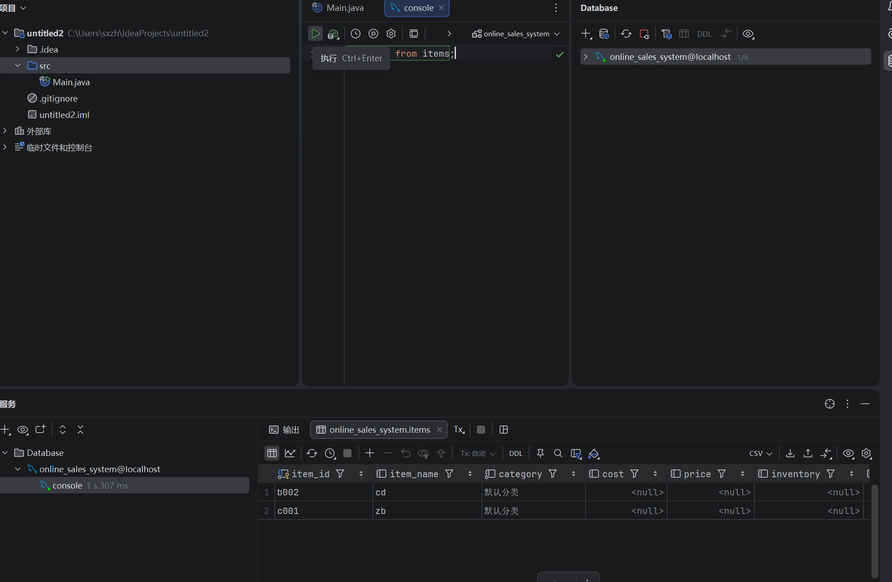

# Java 连接 MySQL Workbench 教程
> 作者：汪辉（24级大数据管理与应用2班）
> 更新日期：2026-01-05


## 一、概述

本教程将指导你如何使用 Java 连接 MySQL 数据库，而 MySQL Workbench 作为数据库管理工具，用于创建和管理数据库结构。我们将使用 IntelliJ IDEA 来帮助实现 Java 与 MySQL 的连接。

## 二、准备工作

### 1. 安装工具

*   **Java 开发环境（JDK）**：确保已安装 JDK（建议使用 JDK 8 或以上版本）。
    
*   **MySQL 数据库**：安装 MySQL Server。
    
*   **MySQL Workbench**：用于可视化管理 MySQL 数据库。
    
*   **IntelliJ IDEA**。

## 三、配置数据库（使用 MySQL Workbench）

1.  打开 MySQL Workbench。
    
2.  连接本地或远程的 MySQL 服务器。
    
3.  准备数据库。

## 四、创建 Maven 项目，连接数据库并执行 SQL 语句

### 1、打开 IDEA，点击文件—新建—项目


### 2、选择 Maven，点击创建


### 3、双击打开 pom.xml,复制粘贴下方代码块

```xml
<?xml version="1.0" encoding="UTF-8"?>
<project xmlns="http://maven.apache.org/POM/4.0.0"
         xmlns:xsi="http://www.w3.org/2001/XMLSchema-instance"
         xsi:schemaLocation="http://maven.apache.org/POM/4.0.0 http://maven.apache.org/xsd/maven-4.0.0.xsd">
    <modelVersion>4.0.0</modelVersion>

    <groupId>org.example</groupId>
    <artifactId>mysql-connect-demo</artifactId>
    <version>1.0-SNAPSHOT</version>

    <properties>
        <maven.compiler.source>8</maven.compiler.source>
        <maven.compiler.target>8</maven.compiler.target>
    </properties>

    <dependencies>
        <dependency>
            <groupId>mysql</groupId>
            <artifactId>mysql-connector-java</artifactId>
            <version>8.0.33</version> <!-- 无空格的有效版本 -->
            <scope>runtime</scope>
        </dependency>

    </dependencies>
    <build>
        <plugins>
            <plugin>
                <groupId>org.apache.maven.plugins</groupId>
                <artifactId>maven-compiler-plugin</artifactId>
                <configuration>
                    <source>25</source>
                    <target>25</target>
                </configuration>
            </plugin>
        </plugins>
    </build>

</project>
```


### 4、选择 Java—新建—Java 类，自由命名



### 5、复制粘贴如下代码

```java
package mysql;

import java.sql.Connection;
import java.sql.DriverManager;
import java.sql.PreparedStatement;
import java.sql.ResultSet;
import java.sql.SQLException;

public class mysqlutil {
    static void main() {
        String url = "jdbc:mysql://localhost:3306/online_sales_system?serverTimezone=Asia/Shanghai&useSSL=false&allowPublicKeyRetrieval=true";
        String user = "root";
        String password = "wh944555";

        Connection conn = null;
        PreparedStatement pstmt = null;
        ResultSet rs = null;

        try {
            Class.forName("com.mysql.cj.jdbc.Driver");
            conn = DriverManager.getConnection(url, user, password);
            System.out.println("数据库连接成功，查询全表数据：");

            // 查items表所有数据
            String sql = "SELECT item_id, item_name FROM items"; // 补充实际字段名
            pstmt = conn.prepareStatement(sql);
            rs = pstmt.executeQuery();

            // 遍历结果集（用getString获取item_id的字符串值）
            while (rs.next()) {
                String itemId = rs.getString("item_id"); // 关键修正
                String itemName = rs.getString("item_name"); // 按实际字段类型选择方法
                System.out.println("商品ID：" + itemId + "，商品名称：" + itemName);
            }

        } catch (ClassNotFoundException | SQLException e) {
            e.printStackTrace();
        } finally {
            // 关闭资源
            try {
                if (rs != null) rs.close();
                if (pstmt != null) pstmt.close();
                if (conn != null) conn.close();
            } catch (SQLException e) {
                e.printStackTrace();
            }
        }
    }
}
```

### 6、注意！！！如遇错误可自行修改


### 7、填写数据库名称、账号和密码，用 SQL 语句作查询操作


### 8、连接且成功查询（例）


## 五、彩蛋：使用 IntelliJ IDEA，无代码版

### 1、打开 IntelliJ IDEA


### 2、新建项目


### 3、自由命名项目


### 4、选择 Database


### 5、选择新建


### 6、找到 MySQL


### 7、输入 MySQL Workbench 用户名、密码和所要连接的数据库名称


### 8、成功连接数据库，直接输入 SQL 语句执行即可（例）


