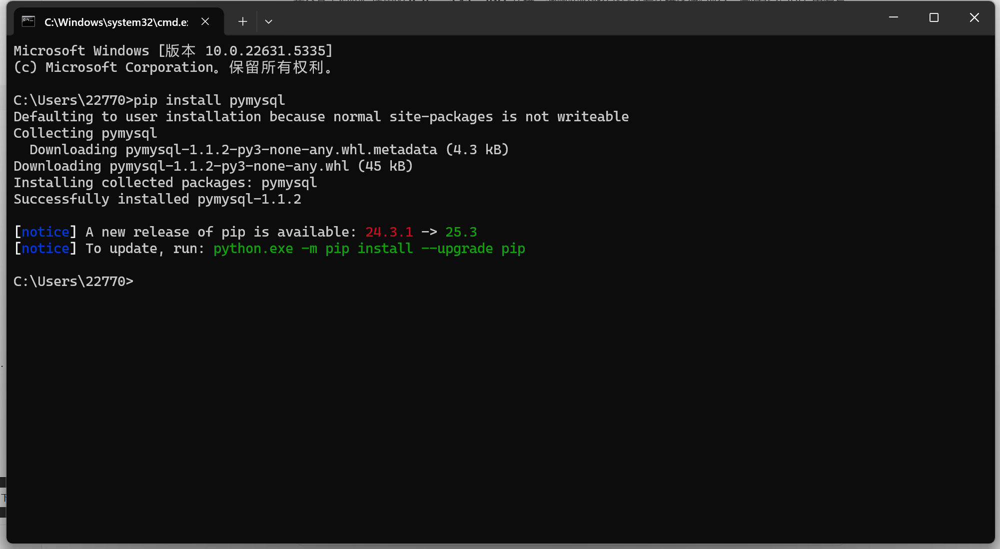
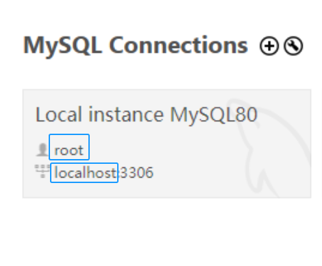
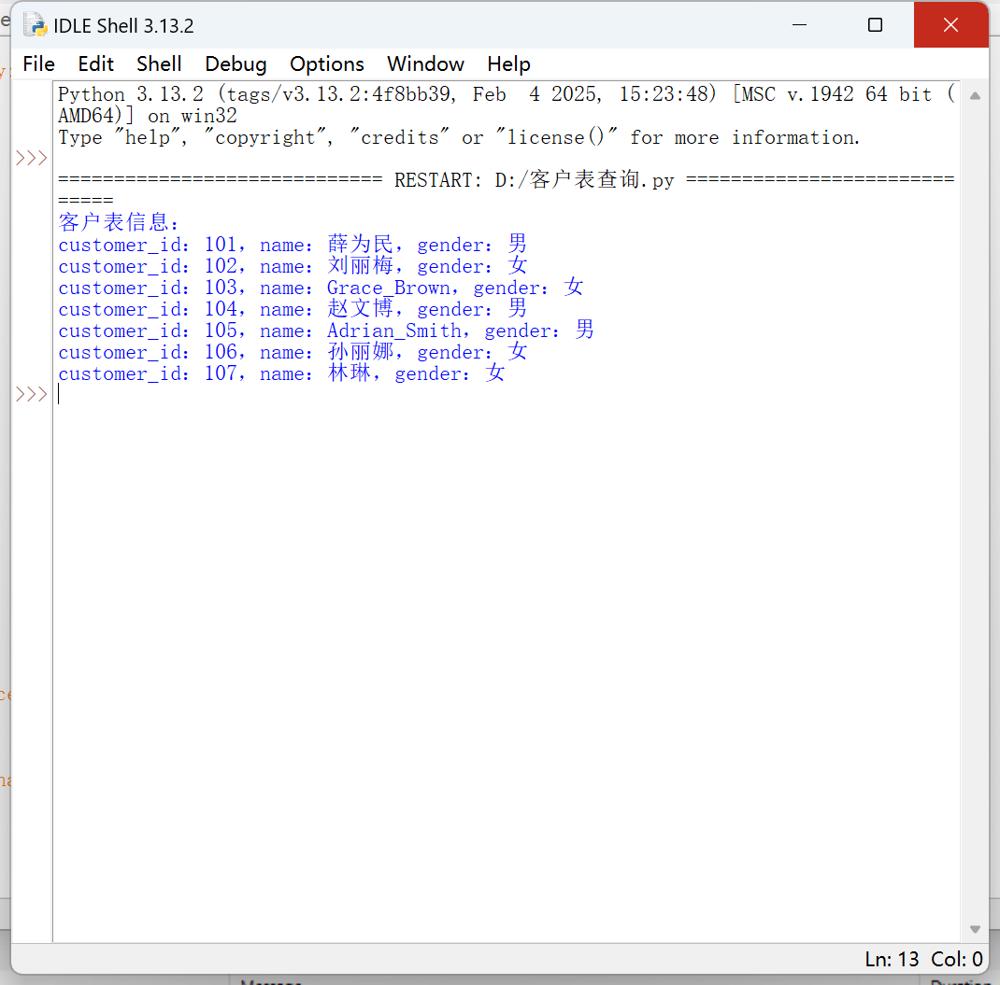

# Python 连接 MySQL 数据库示例

> 作者：刘佳薇（24级大数据管理与应用1班）
更新日期： 2025-12-30


## 一、环境准备

### 安装 Python MySQL 驱动

打开 Windows"命令提示符（CMD）"，执行以下命令（Python 3.13 已自带`pip`）：

```shell
pip install pymysql
```

出现 "Successfully installed pymysql-xxx" 提示即安装成功。如图：



## 二、基础连接示例

### 基本连接参数并建立连接

打开 Python IDLE 界面执行下面代码：

```python
import pymysql

# 数据库连接参数（请替换为自己的MySQL配置）
config = {
    "host": "localhost",    # 本地MySQL服务
    "user": "root",         # MySQL用户名
    "password": "你的密码",  # MySQL密码
    "db": "你的数据库名", # 数据库名
    "charset": "utf8mb4"    # 支持中文
}

try:
    # 建立数据库连接
    conn = pymysql.connect(**config)
    print("数据库连接成功！")
except Exception as e:
    print(f"数据库连接失败：{e}")
finally:
    # 关闭连接
    if 'conn' in locals():
        conn.close()
```

最后，无论是否报错，都要关闭游标和连接，释放数据库资源。

执行代码后，控制台输出：数据库连接成功！，表示 Python 与 MySQL 已正常通信。

通过 MySQL 的连接配置页面可以看到自己的 host 和 user，一般皆为"localhost"和"root"，"localhost"等效于 IP 地址。如图：



## 三、基本操作示例

### 1. 查询操作

查询教材提供的 online_sales_system 库中表 customers，将"password":后改为自己 MySQL 的密码，可直接执行：

```python
# 导入Python操作MySQL的核心库
import pymysql
# 定义数据库连接配置字典
config = {
    "host": "localhost",
    "user": "root",
    "password": "你的密码",
    "db": "online_sales_system",
    "charset": "utf8mb4"
}

try:
    # 建立数据库连接（核心语法：pymysql.connect()）
    # **config：将字典参数解包传入，等价于host="localhost", user="root"...
    conn = pymysql.connect(**config)

    # 创建游标对象
    # pymysql.cursors.DictCursor：指定查询结果以字典（字段名:值）形式返回，更易读取
    # 若不指定，默认返回元组（需按索引取值，如result[0]）
    cursor = conn.cursor(pymysql.cursors.DictCursor)  

    # 执行基础查询SQL
    # SELECT 字段1, 字段2 FROM 表名：查询指定表的指定字段，*代表查询所有字段
    sql = "SELECT customer_id,name,gender FROM customers"

    # 执行SQL语句（游标核心方法：execute()）
    # 语法：cursor.execute(SQL语句, 参数元组)，无参数时仅传SQL即可
    cursor.execute(sql)
  
    # 获取查询结果（游标获取结果的核心方法）
    # fetchall()：获取所有符合条件的结果，返回列表（每个元素是字典/元组）
    result = cursor.fetchall()  

    # 打印查询结果
    # 字典取值语法：字典名['字段名']，对应SQL查询的字段
    print("客户表信息：")
    for customers in result:
        print(f"customer_id：{customers['customer_id']}，name：{customers['name']}，gender：{customers['gender']}")

    # 异常捕获（处理连接/查询过程中的错误，如密码错误、表不存在等）
except Exception as e:
    print(f"查询失败：{e}")
  
    # 最终执行（无论是否报错，都要关闭游标和连接，释放数据库资源）
finally:
    # 关闭游标：游标使用完毕必须关闭，避免资源占用
    cursor.close()
    # 关闭数据库连接：连接使用完毕必须关闭，否则会耗尽数据库连接数
    conn.close()
```

执行结果如下：



## 四、常见问题解决

### 1. 连接超时

*   检查 MySQL 服务是否启动
*   验证 host 和 port 是否正确
*   检查防火墙设置是否允许对应端口

### 2. 认证失败

*   确认用户名和密码正确
*   检查 MySQL 用户权限配置

### 3. 编码问题

```python
# 在连接参数中添加字符集配置
'charset': 'utf8mb4',
'collation': 'utf8mb4_unicode_ci'
```

### 4. SQL 注入防护

*   始终使用参数化查询（`%s` 占位符）
*   避免字符串拼接 SQL 语句

通过以上示例，可以实现 Python 对 MySQL 数据库的基本操作。