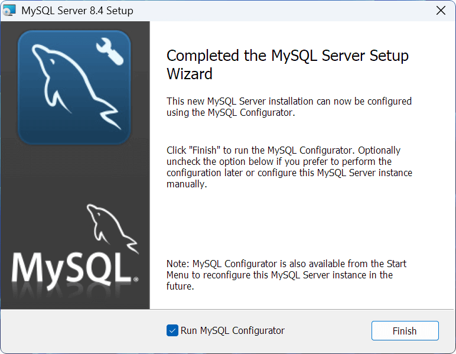
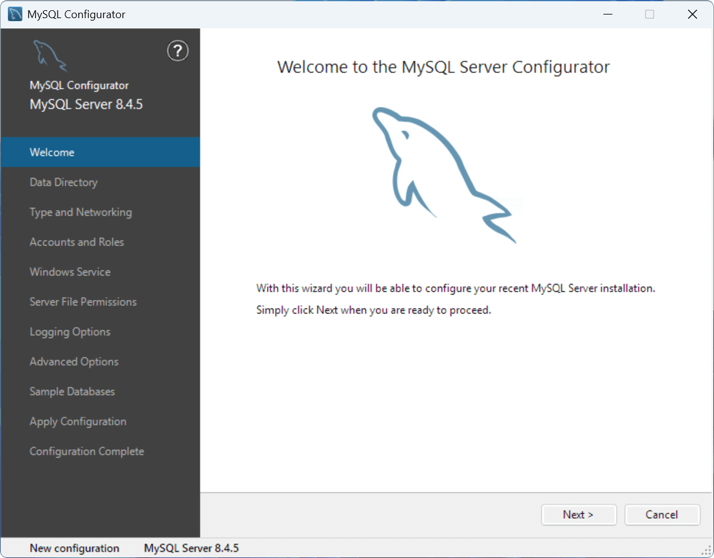
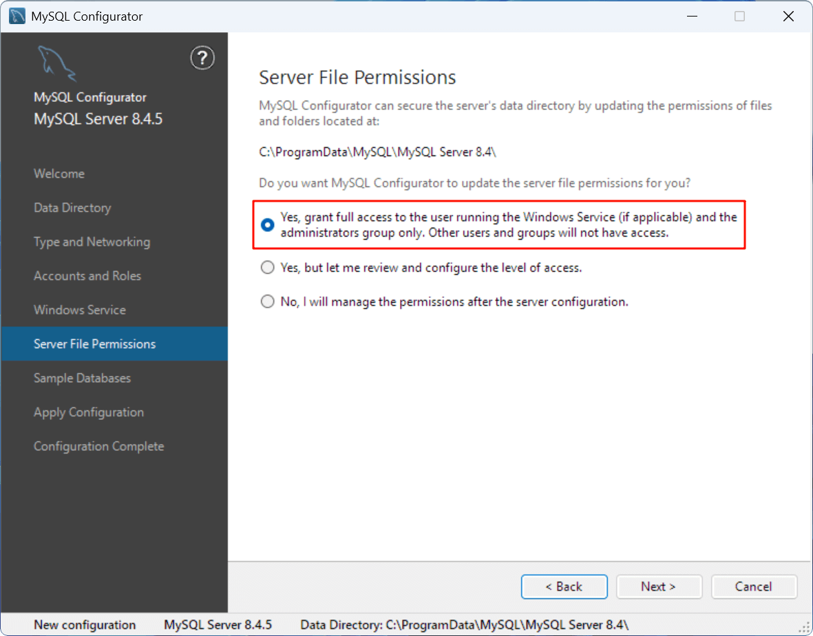

访问 [MySQL Community Downloads 官网](https://dev.mysql.com/downloads/mysql/)，选择最新的 `8.4.x LTS`（长期支持）版本和 `Microsoft Windows` 平台，下载 `MSI Installer` 安装程序


---

如果下载提示要求登录或注册，可以**点击下方蓝色文字链接跳过**，直接开始下载


---

## 安装 MySQL 服务器

打开 MySQL 安装程序，点击 **"Next"** 开始配置


---

勾选同意最终用户许可协议，点击 **"Next"** 继续


---

选择安装类型，一般选择 **"Typical"**（典型）即可，其他组件可以在需要时再进行安装

!!! warning "不建议更改默认安装路径"

    如果选择 **"Custom"** 可以更改安装路径，但为了避免路径问题并方便故障排查，**不建议更改默认安装路径！**

    - **MySQL 及相关组件的默认安装目录（basedir）**：`C:\Program Files\MySQL`
    - **MySQL 相关数据文件的默认存放目录（datadir）**：`C:\ProgramData\MySQL`


---

点击 **"Install"** 开始安装 MySQL Server


---

安装完成后，勾选 **"Run MySQL Configurator"**，并点击 **"Finish"**



---

## 配置 MySQL 服务器

使用 **"MySQL Configurator"** 配置 MySQL 服务器，点击 **"Next"** 继续

note "运行 MySQL Configurator"

    如果之前未勾选 **"Run MySQL Configurator"**，或是需要重新配置 MySQL 服务器，可以在 Windows
    开始菜单找到（或搜索）`MySQL 8.4 Configurator` 手动运行



---

### 数据目录（Data Directory）

设置 MySQL 服务器管理的数据存储目录，**保持默认路径**即可

!!! warning "不建议更改默认数据路径"

    为了避免路径问题并方便故障排查，**不建议更改默认数据路径！**

    - **MySQL 及相关组件的默认安装目录（basedir）**：`C:\Program Files\MySQL`
    - **MySQL 数据库等数据文件存放目录（datadir）**：`C:\ProgramData\MySQL`


---

### 类型与网络（Type and Networking）

选择默认的 **`Development Computer`**（开发计算机），并**勾选** `TCP/IP` 协议并保持 `3306/33060` 端口（Port）即可，无需任何修改

!!! warning "保持默认端口"

    所有 MySQL 客户端/驱动都默认连接 `3306` 端口，非必要情况下（如端口冲突或安全策略等）务必保持默认的
    `3306/33060` 端口。如果更改默认端口，后续连接数据库时需显式指定端口。

??? example "类型与网络选项说明 [^1]"

    **Server Configuration Type（服务器配置类型）**：根据主机用途预分配 MySQL 实例的系统资源（CPU/内存/并发连接数等）。
    
    - `Development Computer`：不限于 MySQL 开发的一般计算机，MySQL 将占用最小内存。
    - `Server Computer`：专用于运行多个服务器应用的计算机，MySQL 将占用中等内存。
    - `Dedicated Computer`：专用于运行 MySQL 数据库的服务器，MySQL 将充分利用所有可用内存。
    - `Manual`：保留默认配置文件值，如果需要进行任何更改，必须手动编辑配置文件更新数值。
    
    ---

    **Connectivity（连接方式）**：MySQL 服务器支持多种连接方式，包括 `TCP/IP`、`Named Pipes` 和 `Shared Memory`。
    
    - `TCP/IP`：通过网络协议通信，适用于分布式环境，标准 SQL 协议端口为 `3306`，X 协议端口 `33060` 用于 MySQL 文档存储（NoSQL）。
    - `Named Pipes`：基于命名管道的进程间通信（IPC）机制，仅限本地连接，比 TCP/IP 开销更低。
    - `Shared Memory`：通过内存共享实现进程间通信，仅限本地连接，速度最快但安全性最低。
    
    ---

    **Advanced Configuration（高级配置）**：勾选后显示服务器 ID、表名大小写规则和日志等高级选项。


---

### 账户与角色（Accounts and Roles）

在上方**设置 Root 用户密码**，下方的 MySQL User Accounts（MySQL 用户账户）无需配置

!!! note "密码强度与重置密码"

    MySQL 用户密码要求最少为 4 个字符，建议使用`数字+大小写字母+特殊字符`等长字符串以提高密码强度。如果忘记 Root
    用户密码，可以参考 [MySQL 重置 root 密码（菜鸟教程）](https://www.runoob.com/note/27730) 进行重置。

??? example "账户与角色选项说明 [^2]"

    **Root 用户**是数据库系统中的超级用户，拥有最高权限，可以对数据库实例进行管理和配置，包括创建用户和管理权限，数据库和表的创建、修改和删除，管理数据库实例和配置等。

    ---

    **MySQL User Accounts（MySQL 用户账户）**用于添加数据库管理员、开发者或只读用户等身份角色，并限制特定用户对数据库的操作范围，以确保数据库的安全性和合规性。


---

### Windows 服务（Windows Service）

默认**勾选 `Configure MySQL Server as a Windows Service`**（设置 MySQL 服务器作为 Windows 服务）即可，其中
"Windows Service Name"（Windows 服务名称）无需修改，其他选项默认即可

??? example "Windows 服务选项说明 [^3]"

    在 Windows 平台上，MySQL 服务器可以作为操作系统管理的服务运行，并配置为开机时自动启动，持续在后台运行。默认以
    `Standard System Account`（标准系统账户）身份启动，如果需要配置权限，可以勾选 `Custom User`（自定义用户）。

    !!! tip ""
        
        如果发现无法连接至 MySQL 服务器，应当首先检查 MySQL 服务（如 `MySQL84`）是否已启动


---

### 服务器文件权限（Server File Permissions）

默认**选择第一项**，将 MySQL 文件夹及文件的**完全访问权限**仅授予运行 Windows 服务的用户和管理员组

??? example "服务器文件权限选项说明 [^4]"

    访问权限涉及 MySQL 服务器数据、配置和日志等文件（默认位于 `C:\ProgramData\MySQL\MySQL Server 8.4`），为了保护数据安全，此权限通常仅授予运行
    Windows 服务的用户和管理员组，普通用户无权访问和修改。



---

### 示例数据库（Sample Databases）

根据需要选择是否创建示例数据库，可选 `Sakila` 和 `World` 数据库，以便快速上手和练习

!!! info "示例数据库简介"

    <div class="grid cards" markdown>

    -   **Sakila 数据库**  

        - 一个模拟 DVD 租赁商店的完整业务数据库
        - 包含电影库存、租赁记录、客户信息等 16 张表

        详见：[MySQL :: Sakila Sample Database](https://dev.mysql.com/doc/sakila/en/)

    -   **World 数据库**

        - 包含国家/城市/语言信息的简化全球数据集
        - 仅 3 张核心表（country/city/countrylanguage）

        详见：[MySQL :: Setting Up the world Database](https://dev.mysql.com/doc/world-setup/en/)

    </div>


---

### 应用配置（Apply Configuration）

配置完成后，点击 **"Execute"** 应用配置更改，等待所有项目配置完成

??? warning "配置更改遇到问题或错误？"

    应用配置时，如果遇到某些问题或错误导致中断，请根据右侧 **`Log`（日志）栏中的报错信息**，使用网络搜索可能的解决方案。
    
    例如，在 `Starting the server` 步骤出错可能是由于**端口（3306）被占用**导致无法正常启动 MySQL 服务，可以尝试找出并结束占用此端口的进程后重新应用配置。
    
    如果**计算机名为特殊字符**（如中文），建议更改为 ASCII 字符（如纯英文），否则在应用 MySQL 配置时可能会发生错误（提示 `file 'xxx-bin.index' not found`）。
    
    !!! example ""    

        **常见安装错误及解决方案可参考**：[常见安装错误](faq.md)


---

### 配置完成（Configuration Complete）

执行所有应用配置步骤后，安装和配置完成！


---

## 设置 MySQL 环境变量

!!! info "设置 MySQL 系统环境变量"

    为了能够使用 CMD 和 PowerShell 等终端（也可以使用 `MySQL Command Line Client`）连接至 MySQL
    服务器，并使系统和其他应用程序能够定位到 MySQL 的执行文件，建议将 MySQL 的 `bin`
    路径（可执行文件目录）添加至系统环境变量中。

    !!! note ""
    
        MySQL Server 默认的 `bin` 目录路径为：`C:\Program Files\MySQL\MySQL Server 8.4\bin`

在 Windows 搜索栏搜索 **"环境变量"**，并点击 **"编辑系统环境变量"**，打开系统环境变量配置


---

在 **"系统属性 > 高级"** 页面下点击 **"环境变量"**，并双击打开在 **"环境变量 > 系统变量"** 下的 **"Path"** 变量:

<div class="grid" markdown>


</div>

---

在右上方点击 **"新建"** 变量，并将值设为 MySQL Server 的 **`bin`** 目录路径


---

为了验证是否已正确配置，可以在终端中执行下列命令，如果提示如下版本信息则说明配置成功

``` pwsh-session
PS> mysql -V  # 或 mysql --version
```


---

## 连接 MySQL 服务器 [可选]

打开终端，输入并执行下列命令，并输入 **Root 用户密码**进行登录

``` pwsh-session
PS> mysql -u root -p  # 或 mysql --user root --password
```

???+ example "连接 MySQL 服务器命令参数说明"

    - `-h`, `--host`：指定服务器地址，默认为 `localhost`
    - `-P`, `--port`：指定服务器端口，默认为 `3306`
    - `-u`, `--user`：指定登录用户
    - `-p`, `--password`：指定用户密码


---

如果提示如下信息则说明登录成功，可以在其中输入 **MySQL 语句**进行执行

??? tip "常用 MySQL 语句"

    ``` sql title="数据库操作"
    SHOW DATABASES;                                -- 查看所有数据库
    CREATE DATABASE db_name;                       -- 创建数据库
    USE db_name;                                   -- 切换数据库
    DROP DATABASE db_name;                         -- 删除数据库
    ALTER DATABASE db_name CHARACTER SET utf8mb4;  -- 修改数据库字符集
    ```
    
    ``` sql title="表操作"
    SHOW TABLES;                                          -- 查看当前数据库所有表
    CREATE TABLE table_name (id INT PRIMARY KEY);         -- 创建表
    DESC table_name;                                      -- 查看表结构
    ALTER TABLE table_name ADD COLUMN name VARCHAR(50);   -- 修改表结构
    DROP TABLE table_name;                                -- 删除表
    SELECT * FROM table_name LIMIT 10;                    -- 查询数据（前 10 条）
    INSERT INTO table_name VALUES (1, 'data');            -- 插入数据
    UPDATE table_name SET column1=value WHERE condition;  -- 更新数据
    DELETE FROM table_name WHERE condition;               -- 删除数据
    ```
    
    ``` sql title="实用命令"
    STATUS;  -- 查看服务器状态
    EXIT;    -- 退出 MySQL 客户端
    ```

    - **其他常用 MySQL 语句可参考**：[MySQL 命令大全 | 菜鸟教程](https://www.runoob.com/mysql/mysql-command-manual.html)

    - **所有 MySQL 语句及用法详见官方文档**：[MySQL :: MySQL 8.4 Reference Manual :: 15 SQL Statements](https://dev.mysql.com/doc/refman/8.4/en/sql-statements.html)


[^1]: [MySQL :: MySQL Installer Guide :: 4.1.1 Type and Networking](https://dev.mysql.com/doc/mysql-installer/en/server-type-network.html)
[^2]: [MySQL :: MySQL Installer Guide :: 4.1.3 Accounts and Roles](https://dev.mysql.com/doc/mysql-installer/en/server-accounts-roles.html)
[^3]: [MySQL :: MySQL Installer Guide :: 4.1.4 Windows Service](https://dev.mysql.com/doc/mysql-installer/en/server-windows-service.html)
[^4]: [MySQL :: MySQL Installer Guide :: 4.1.5 Server File Permissions](https://dev.mysql.com/doc/mysql-installer/en/server-file-permission-options.html)