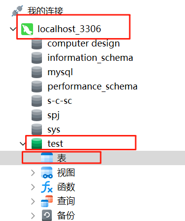
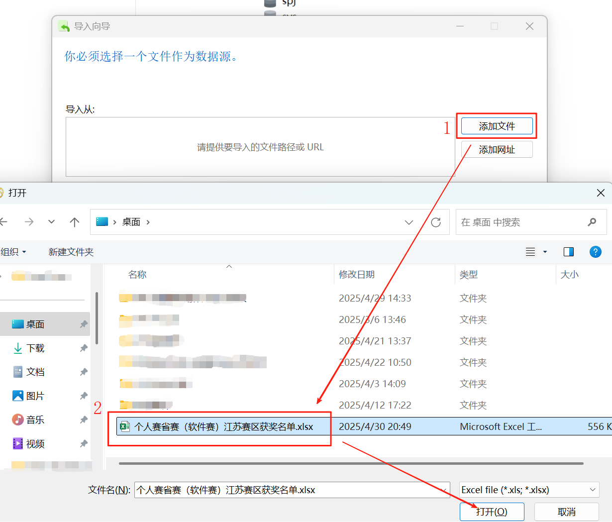
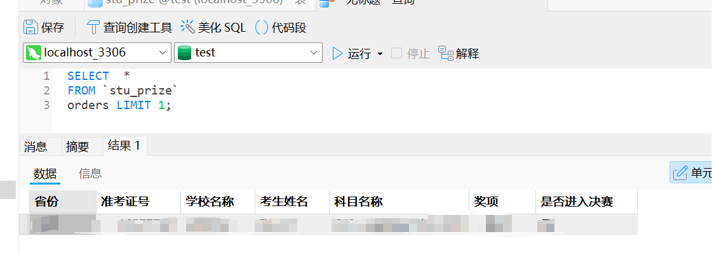
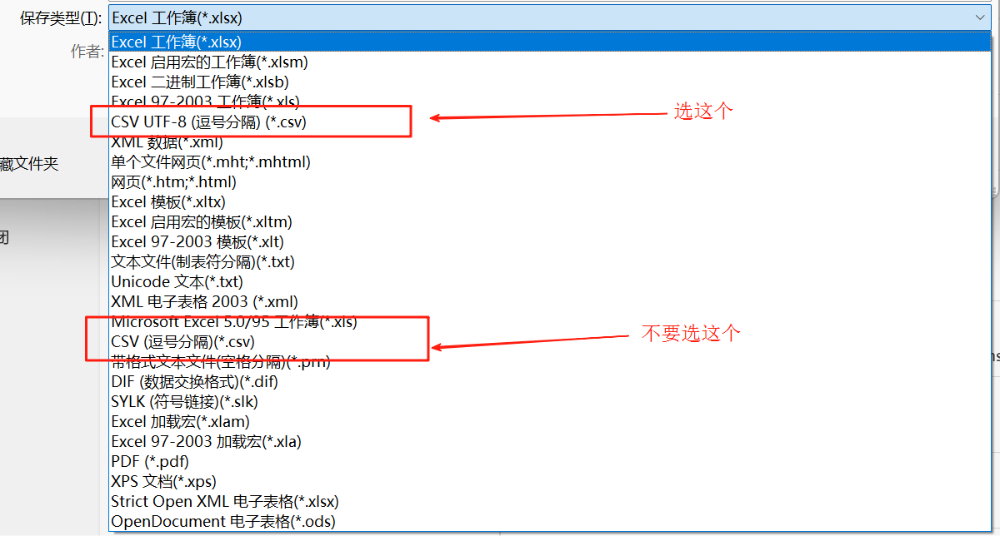
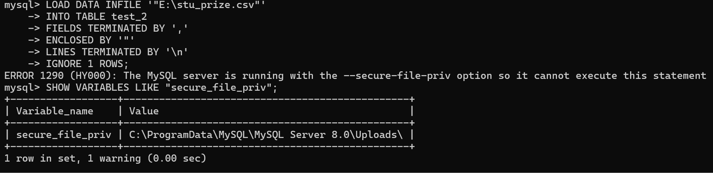

# 关系数据库：外部数据导入
> 作者：庄文博，原文来源：[FlowUs 数据库：外部数据导入](https://flowus.cn/share/f34dbed7-6922-4417-9665-4fe878291e84)，本文按课程规范整理并补充注意事项。


本文整理了三种常见的 MySQL 外部数据导入方案，并给出操作示例与常见问题：

- 方案一：使用Navicat客户端工具导入Excel表格
- 方案二：使用LOAD DATA INFILE语句在命令行导入csv文件
- 方案三：使用程序设计语言（如Python）导入数据


## 方案一、使用Navicat客户端工具导入Excel表格


1、连接并且创建数据库：



2、右键表→导入向导，选择Excel文件，点击下一步


3、到指定路径选择文件：


4、勾选导入的表：


5、如果表第一行有字段名，则：；


如果没有，那就取消上图的勾选，并且第一个数据行改为1：


6、选择目标表，并且指定名称（可选，这里是方便你数据库编程的时候建立数据模型，建议英文命名字段和表名称）：


7、设置字段映射（目标字段建议使用英文）：


8、选择导入模式（如全表导入选择追加）：


9、点击开始按钮：


当出现已添加，错误为0的时候，导入成功。

10、检查导入情况：



## 方案二：使用LOAD DATA INFILE语句在命令行导入csv文件

首先，命令行直接导入只支持`.sql`文件和`.csv`文件

一、文件转换

将你获取到的xsl、xslx格式的文件另存为，转换为CSV UTF-8编码格式的文件



二、导入CSV文件

1、创建表结构

```SQL
CREATE TABLE your_table_name (
    column1_name datatype,
    column2_name datatype,
    ...
    columnN_name datatype
);
```

2、导入数据：

```SQL
LOAD DATA INFILE '/path/to/your/file.csv' --表路径
INTO TABLE your_table_name --表名
FIELDS TERMINATED BY ',' --分隔符
ENCLOSED BY '"'
LINES TERMINATED BY '\n' --换行符
IGNORE 1 ROWS;  -- 如果CSV有标题行就加上这一行
```

同样的，你可以在导入的时候处理数据：

```SQL
LOAD DATA INFILE '/path/to/file.csv'
INTO TABLE your_table
FIELDS TERMINATED BY ','
(@col1, @col2, @col3)  -- 读取为变量
SET column1 = @col1,    
    column2 = NULLIF(@col2,''),  -- 处理空值
    column3 = STR_TO_DATE(@col3, '%Y-%m-%d');  -- 转换日期格式
```

附件：导入过程


注意如果报`ERROR 1290`，如下图处理，将要导入的文件放入指定的文件夹下即可。



注意路径用`/`斜杠


## 使用程序设计语言（如Python）导入数据

提示：这是一个较为简陋的程序，不保证可以处理全部需求，没有经过严谨测试，只确认可以处理正常的表。

一、工具的安装

1、确保你会使用pip安装第三方库，会在pip慢的时候自行换源（网上可以搜的到）。

> 此外，我们学校清华源被ban了，记得用阿里源或者中科大的源。

2、安装要用到的`pandas`、`sqlalchemy`、`mysql.connector`等库。

```Python
pip3 install pandas sqlalchemy mysql-connector-python
```

如果你电脑里面有多个python：

```Python
py -3.x -m pip install pandas sqlalchemy mysql-connector-python  # x替换为你要安装的版本，大版本即可
```

二、使用Python操作MySQL进行数据导入

1、复制这段代码并且运行，按照引导操作

```Python
import os
import pandas as pd
import mysql.connector
from mysql.connector import Error
from sqlalchemy import create_engine, inspect
from sqlalchemy.types import Integer, Float, String, Text, Date, DateTime, Time, Boolean, DECIMAL

class DatabaseImporter:
    def __init__(self, host, database, user, password):
        self.host = host
        self.database = database
        self.user = user
        self.password = password
        self.engine = None
        self.connect()
        
    def connect(self):
        try:
            self.engine = create_engine(
                f"mysql+mysqlconnector://{self.user}:{self.password}@{self.host}/{self.database}",
                echo=False
            )
            print("成功连接到MySQL数据库")
        except Error as e:
            print(f"连接数据库时出错: {e}")
            raise

    def import_file(self, file_path, table_name=None, if_exists='fail'):
        if not os.path.exists(file_path):
            raise FileNotFoundError(f"文件不存在: {file_path}")
        # 确定文件类型
        file_ext = os.path.splitext(file_path)[1].lower()
        # 如果没有指定表名，使用文件名(不含扩展名)
        if table_name is None:
            table_name = os.path.splitext(os.path.basename(file_path))[0]
        # 读取文件
        try:
            if file_ext == '.csv' or file_ext == '.txt':
                # 自动检测分隔符
                with open(file_path, 'r') as f:
                    first_line = f.readline()
                
                sep = ','  # 默认逗号分隔
                if '\t' in first_line:
                    sep = '\t'
                elif ';' in first_line:
                    sep = ';'
                elif '|' in first_line:
                    sep = '|'  
                df = pd.read_csv(file_path, sep=sep, encoding_errors='ignore')
            elif file_ext in ('.xls', '.xlsx'):
                df = pd.read_excel(file_path)
            else:
                raise ValueError(f"不支持的文件类型: {file_ext}")
            print(f"成功读取文件: {file_path}")
            print(f"数据预览:\n{df.head()}")

            # ====== 字段重命名模块 ======
            print("\n当前字段名：", list(df.columns))
            rename_choice = input("是否需要重命名字段？(y/N): ").strip().lower()
            if rename_choice == "y":
                new_columns = []
                for col in df.columns:
                    new_col = input(f"将字段 '{col}' 重命名为（直接回车表示不变）: ").strip()
                    if new_col:
                        new_columns.append(new_col)
                    else:
                        new_columns.append(col)
                df.columns = new_columns
                print("重命名后字段名：", list(df.columns))
            # ==========================

             # ====== 字段类型转换模块 ======
            print("\n字段类型转换（可选）：")
            type_map = {
                "1": ("int", "整数类型，适用于没有小数的数字", lambda s: pd.to_numeric(s, errors="coerce").astype("Int64"), Integer()),
                "2": ("float", "单精度浮点数，适用于带小数的数字", lambda s: pd.to_numeric(s, errors="coerce"), Float()),
                "3": ("double", "双精度浮点数，适用于高精度小数", lambda s: pd.to_numeric(s, errors="coerce"), Float(precision=53)),
                "4": ("decimal", "高精度定点数，适合财务数据", lambda s: pd.to_numeric(s, errors="coerce"), DECIMAL(38, 10)),
                "5": ("varchar", "变长字符串，适合一般文本", lambda s: s.astype(str), String(255)),
                "6": ("text", "长文本，适合大段文字", lambda s: s.astype(str), Text()),
                "7": ("date", "日期类型，仅包含年月日", lambda s: pd.to_datetime(s, errors="coerce").dt.date, Date()),
                "8": ("datetime", "日期时间类型，包含年月日时分秒", lambda s: pd.to_datetime(s, errors="coerce"), DateTime()),
                "9": ("time", "时间类型，仅包含时分秒", lambda s: pd.to_datetime(s, errors="coerce").dt.time, Time()),
                "10": ("bool", "布尔类型，True/False", lambda s: s.astype(bool), Boolean()),
            }
            print("常用类型：")
            for k, v in type_map.items():
                print(f"{k}: {v[0]} —— {v[1]}")
            dtype_dict = {}
            for col in df.columns:
                type_choice = input(f"字段 '{col}' 选择类型(直接回车跳过): ").strip()
                if type_choice in type_map:
                    try:
                        # 处理varchar长度
                        if type_choice == "5":
                            length = input(f"字段 '{col}' 选择varchar长度(默认255): ").strip()
                            length = int(length) if length.isdigit() and int(length) > 0 else 255
                            df[col] = type_map[type_choice][2](df[col])
                            dtype_dict[col] = String(length)
                        # 处理decimal精度
                        elif type_choice == "4":
                            precision = input(f"字段 '{col}' decimal总位数(默认38): ").strip()
                            scale = input(f"字段 '{col}' decimal小数位数(默认10): ").strip()
                            precision = int(precision) if precision.isdigit() and int(precision) > 0 else 38
                            scale = int(scale) if scale.isdigit() and int(scale) >= 0 else 10
                            df[col] = type_map[type_choice][2](df[col])
                            dtype_dict[col] = DECIMAL(precision, scale)
                        else:
                            df[col] = type_map[type_choice][2](df[col])
                            dtype_dict[col] = type_map[type_choice][3]
                    except Exception as e:
                        print(f"字段 '{col}' 转换失败: {e}")
            # ==========================

            # ====== 空值处理模块 ======
            if df.isnull().values.any():
                print("\n检测到数据中存在空值。")
                print("请选择空值处理方式：")
                print("1. 保留为空")
                print("2. 填充为指定值")
                print("3. 删除含空值的行")
                choice = input("输入选项(1/2/3, 默认1): ") or "1"
                if choice == "2":
                    fill_value = input("请输入要填充的值（如0、空字符串等）: ")
                    try:
                        fill_value = eval(fill_value)
                    except:
                        pass
                    df = df.fillna(fill_value)
                elif choice == "3":
                    df = df.dropna()

            # =========================
            df.to_sql(
                name=table_name,
                con=self.engine,
                if_exists=if_exists,
                index=False,
                dtype=dtype_dict if dtype_dict else None
            )
            print(f"成功导入数据到表: {table_name}")
            self.show_table_schema(table_name)
        except Exception as e:
            print(f"导入过程中出错: {e}")
            raise
        
    def show_table_schema(self, table_name):
        inspector = inspect(self.engine)
        columns = inspector.get_columns(table_name)
        print(f"\n表 '{table_name}' 结构:")
        for column in columns:
            print(f" - {column['name']}: {column['type']}")

    def list_tables(self):
        inspector = inspect(self.engine)
        tables = inspector.get_table_names()
        print("\n数据库中的表:")
        for table in tables:
            print(f" - {table}")

def main():
    print("=== 数据导入工具 ===")
    host = input("MySQL主机地址(默认localhost): ") or "localhost"
    database = input("数据库名称: ")
    user = input("用户名: ")
    password = input("密码: ")
    try:
        importer = DatabaseImporter(host, database, user, password)
    except Exception as e:
        print(f"初始化失败: {e}")
        return
    file_path = input("\n输入要导入的文件路径: ").strip('"\' ')
    table_name = input("目标表名(留空使用文件名): ") or None
    if_exists = input("表存在时如何处理? (fail/replace/append, 默认fail): ") or 'fail'
    try:
        importer.import_file(file_path, table_name, if_exists)
        importer.list_tables()
    except Exception as e:
        print(f"导入失败: {e}")

if __name__ == "__main__":
    main()
```

2、执行结果参考

如下，截图中的MySQL主机地址、数据库名、用户名、密码等等，包括要导入的文件路径，待导入的表等都是由用户自行输入的，可以根据提示操作即可。


