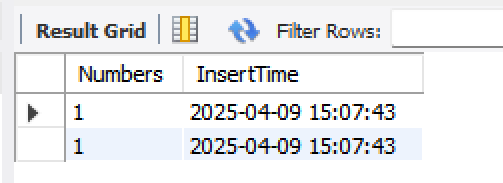
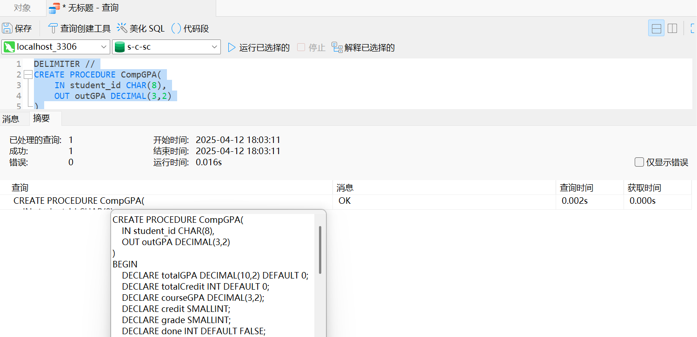

# 触发器与存储过程教材案例MySQL实现
> 作者：黄加慧,庄文博,徐艺榕

> 所用教材：王珊 杜小勇 陈红 高等教育出版社《数据库系统概论》

# 一、触发器

## 例5.18

> **[例5.18]** 当对表SC的Grade属性进行修改时，若分数增加了10%，则将此次操作记录到另一个表 SC_U （Sno CHAR (8),Cno CHAR (5),Oldgrade SMALLINT,Newgrade SMALLINT）中。其中，Oldgrade是修改前的分数，Newgrade是修改后的分数。运行触发器之前需要创建SC_U表。

### 1. MySQL语句
    

```SQL
/*运行触发器之前需要创建SC_U表*/
CREATE TABLE SC_U (
    Sno CHAR(8),
    Cno CHAR(5),
    Oldgrade SMALLINT,
    Newgrade SMALLINT
);

/*运行触发器*/
DELIMITER //
CREATE TRIGGER SC_T  /*SC_T是触发器的名字*/
AFTER UPDATE ON SC  /*UPDATE ON SC 是触发事件*/
/*AFTER是触发的时机，表示当时对SC的Grade属性修改完后再触发下面的规则*/
/*注意此处省略书中的REFERENCING子句，在MySQL中，直接使用OLD和NEW来引用旧值和新值，不需要REFERENCING子句*/
FOR EACH ROW
/*行级触发器，即每执行一次Grade的更新，下面的规则就执行一次*/
BEGIN
    IF (NEW.Grade >= 1.1 * OLD.Grade) THEN
/*触发条件，只有该条件为真时才执行下面的insert操作*/ /*注意：书中是WHEN子句，而MySQL不支持WHEN在触发器定义中使用*/
        INSERT INTO SC_U (Sno, Cno, OldGrade, NewGrade)
        VALUES (OLD.Sno, OLD.Cno, OLD.Grade, NEW.Grade);
    END IF;
END //
DELIMITER ;

/*测试触发器*/
UPDATE SC  
SET Grade = Grade * 1.2
WHERE Sno = '20180001' AND Cno = '81001';
SELECT * FROM SC_U;  
```

### 2. 运行示例
    

如下，显示触发器已经存在（即运行成功）。


测试触发器成功


测试两次，示例：Sno='20180001'，Cno='81001'


### 3. 注意事项
    

1. 运行触发器之前需要创建SC_U表

2. 省略书中的`REFERENCING子句`，在MySQL中，直接使用`OLD`和`NEW`
来引用旧值和新值，不需要REFERENCING子句

3. 注意书中是WHEN子句，而MySQL不支持在触发器定义中使用


## 例5.19

> [例5.19]将每次对表Student的插入操作所增加的学生个数记录到表Student Insert（numbers INT）中，运行触发器之前需要创建此表。

### 1. MySQL语句
    

```sql
/*创建StudentInsertLog表*/
CREATE TABLE StudentInsertLog (
    Numbers INT,
    InsertTime TIMESTAMP DEFAULT CURRENT_TIMESTAMP   
);

/*创建测试中的Student表*/
CREATE TABLE IF NOT EXISTS Student (
    Sno VARCHAR(10) PRIMARY KEY,      
    Sname VARCHAR(20) NOT NULL,      
    Ssex VARCHAR(2),                 
    Sbirthdate DATE,                 
    Smajor VARCHAR(20)                      
);

DELIMITER //   
CREATE TRIGGER Student_Count   
AFTER INSERT ON Student   
/*指明触发器激活的时间是在执行INSERT后*/
/*注意：此处MySQL 不支持 REFERENCING NEW TABLE AS Delta*/
FOR EACH ROW   
/*注意：FOR EACH STATEMENT 触发器在 MySQL 中不存在*/
/*逐行触发器，即执行完INSERT语句后*/
BEGIN
    INSERT INTO StudentInsertLog (Numbers)
    VALUES (1);     /*每次插入1，表示新增1条记录*/
END//   
DELIMITER ;   


/*插入数据*/
INSERT INTO Student (Sno,Sname,Ssex,Sbirthdate,Smajor) VALUES 
('20180001','李勇','男','2000-03-08','信息安全'),
('20180002','刘晨','男','1999-09-01','计算机科学与技术');

SELECT * FROM StudentInsertLog;
```

### 2. 运行示例
    
触发器实现与验证成功


实现结果：



### 3. 注意事项
    
1. 此处MySQL不支持`REFERENCING NEW TABLE AS Delta`
2. `FOR EACH STATEMENT`在MySQL触发器中不支持，使用`FOR EACH ROW`行级触发器
3. 要注意插入数据应该在运行触发器之后进行，不然运行出来的表就是空表。

## 例5.20

> [例5.20]定义一个BEFORE行级触发器，为教师表Teacher定义完整性规则：教授的工资不得低于4000元，如果低于4000元，自动改为4000元.

### 1. MySQL语句

说明：对于本题而言，应该创建两个BEFORE行级触发器，`BEFORE INSERT`和`BEFORE UPDATE`，即在插入和更新的时候都应该做工资检查。
为了演示方便，此处只创建了BEFORE UPDATE触发器。

```sql
CREATE TABLE School                              /*创建学院表*/
    (SHno CHAR(8) PRIMARY KEY,                   /*SHno列为主码*/
    SHname VARCHAR(40) UNIQUE,                   /*要求SHname值唯一*/
    SHfounddate Date                             /*学院创建日期*/ 
    ); 


CREATE TABLE Teacher                             /*创建Teacher表*/
    (Eno CHAR(8) PRIMARY KEY,                    /*在列级定义主码*/ 
    Ename VARCHAR(20),
    Job CHAR(8),
    Sal NUMERIC(7,2),                          /*每月工资*/
    Deduct NUMERIC(7,2),                       /*每月扣除项*/
    Schoolno CHAR(8),                          /*教师所在的学院编号*/
    CONSTRAINT TeacherFKey FOREIGN KEY(Schoolno) REFERENCES School(SHno), 
                                                /*外码约束(命名为TeacherFKey)*/
    CONSTRAINT C1 CHECK(Sal+Deduct>=3000)      /*应发工资的约束条件C1*/ 
    );


/*插入数据用于测试*/
INSERT INTO School (SHno, SHname, SHfounddate) 
VALUES ('S001', '计算机学院', '2000-01-01');

INSERT INTO Teacher (Eno, Ename, Job, Sal, Deduct, Schoolno)
VALUES ('T001','王教授','教授',3000,200,'S001');


DELIMITER $$                                   /*更改默认分隔符,注意使用$$作为结束符*/
CREATE TRIGGER Update_Sal                      /*对教师表插入或更新时激活触发器*/ 
BEFORE UPDATE ON Teacher                       /*BEFORE触发事件*/
FOR EACH ROW                                   /*这是行级触发器*/ 
BEGIN                                          /*定义触发动作体,这是一个PL/SQL过程块*/
    IF NEW.Job = '教授' AND NEW.Sal < 4000 THEN/*因为是行级触发器，可在过程体中*/ 
    SET NEW.Sal = 4000;                       /*使用插入或更新操作后的新值*/ 
    END IF; 
END$$                                          /*触发动作体结束*/ 

DELIMITER ;                                    /*恢复默认分隔符*/


/*查询验证*/ 
UPDATE Teacher 
SET Sal = 3000 
WHERE Eno = 'T001' 
AND Job = '教授';
SELECT * FROM Teacher WHERE Eno = 'T001';
```

### 2. 运行示例
    


### 3. 注意事项
    
1. 删除书中的REFERENCING语句，直接使用 NEW 关键字
2. 当创建包含多个语句的触发器时，需要临时更改语句分隔符。
3. 使用`SET NEW.column`的赋值方式代替对象赋值
4. 执行更新操作时必须满足两个条件：
    - 如果 Job 不是'教授'，触发器不会生效
    - 如果原工资已经 >=4000，触发器也不会生效

# 二、存储过程

## 例8.5

> 创建存储过程，计算学生平均学分绩点

### 1. MySQL语句
```sql
DELIMITER //
CREATE PROCEDURE `CompGPA`(
    IN student_id CHAR(8),
    OUT outGPA DECIMAL(3,2)
)
BEGIN
    DECLARE totalGPA DECIMAL(10,2) DEFAULT 0;
    DECLARE totalCredit INT DEFAULT 0;
    DECLARE courseGPA DECIMAL(3,2);
    DECLARE credit SMALLINT;
    DECLARE grade SMALLINT;
    DECLARE done INT DEFAULT FALSE;
    
    -- 声明游标
    DECLARE mycursor CURSOR FOR 
        SELECT c.Ccredit, sc.Grade 
        FROM sc 
        JOIN course c ON sc.Cno = c.Cno 
        WHERE sc.Sno = student_id AND sc.Grade IS NOT NULL;
    
    -- 异常处理：读取完数据后置位 done
    DECLARE CONTINUE HANDLER FOR NOT FOUND SET done = TRUE;
    
    OPEN mycursor;
    
    read_loop: LOOP
        FETCH mycursor INTO credit, grade;
        IF done THEN  -- 检测是否读完
            LEAVE read_loop;
        END IF;
        
        -- 计算GPA
        IF grade BETWEEN 90 AND 100 THEN
            SET courseGPA = 4.0;
        ELSEIF grade BETWEEN 80 AND 89 THEN
            SET courseGPA = 3.0;
        ELSEIF grade BETWEEN 70 AND 79 THEN 
            SET courseGPA = 2.0;
        ELSEIF grade BETWEEN 60 AND 69 THEN
            SET courseGPA = 1.0;
        ELSE
            SET courseGPA = 0;
        END IF;
        
        SET totalGPA = totalGPA + courseGPA * credit;
        SET totalCredit = totalCredit + credit;
    END LOOP;
    
    CLOSE mycursor;
    
    -- 如果无有效成绩，返回0
    IF totalCredit = 0 THEN
        SET outGPA = 0;
    ELSE
        SET outGPA = totalGPA / totalCredit;
    END IF;
END //
DELIMITER ;
```

### 2. 运行示例



### 3. 注意事项

需要注意变量的声明和添加异常处理，具体如下：

#### DECLARE语句

MySQL的DECLARE语句支持一次性定义多个变量。

```sql
DECLARE variable_name1, variable_name2, ..., variable_namen data_type [DEFAULT default_value];
```

1. 同一DECLARE语句中的变量必须是相同的数据类型。
2. 变量声明必须放在存储程序体的开头，在任何可执行语句之前。
3. 每个变量可以有自己的DEFAULT值，但需要在单独的DECLARE语句中声明。

#### 添加异常处理

- 当游标读取完所有数据后，再次执行`FETCH`时会触发`NOT FOUND`条件。
- 若未声明异常处理，该条件会升级为错误 1329。
- 通过添加以下处理器，将错误转为标志位，便于正常退出循环：

```sql
DECLARE CONTINUE HANDLER FOR NOT FOUND SET done = TRUE;
```

实际效果演示（省略或删除该行后，调用阶段可能出现）：

```
1329 - No data - zero rows fetched, selected, or processed
```

结合上面的处理器，在循环中通过判定完成优雅退出：

```sql
IF done THEN
  LEAVE read_loop;
END IF;
```

## 例8.6

> 查询学号 20180001 的学生的平均学分绩点GPA

### 1. MySQL语句
```sql
CALL CompGPA('20180001', @gpa);
SELECT @gpa AS GPA;
```

### 2. 运行示例


