# 课程设计：智能药品管理系统

> 作者：黄妍桃、唐璨
更新日期：2026-06-28

## 项目概述
随着家庭用药种类和数量的增多，药品过期、重复购买、用药记录混乱等问题日益突出。传统纸质记录方式难以追踪药品有效期和库存状态。本系统旨在为家庭提供一套智能化的药品管理解决方案，通过自动预警、库存跟踪、用药记录等功能，帮助用户合理管理药品，避免过期浪费和用药风险。

## 需求分析
### 功能需求
1. **药品档案管理**
   - 药品信息的录入（条形码、名称、单位、有效期、置入药箱、单次用量、购买数量）
   - 最低库存阈值设置
   - 近效期提醒天数配置
   - 增加摄像功能，实现扫码录入

2. **库存管理**
   - 批次库存独立记录（总量、剩余量、开封日期、有效期）
   - 添加药品时自动关联药箱
   - 新药品自动建档

3. **用药记录**
   - 选择批次扣减库存
   - 事务内锁定数据保证一致性
   - 自动更新剩余库存

4. **智能预警**
   - 近效期提醒（可配置提前天数）
   - 过期告警
   - 低库存告警（剩余量低于阈值）

5. **补药清单**
   - 实时计算未过期库存
   - 自动生成补货建议
   - 清单状态管理（待处理/已完成）

6. **药箱管理**
   - 多药箱支持（家庭药箱、旅行药包等）
   - 药箱与家庭成员绑定
   - 药箱内药品查看与删除

7. **家庭管理**
   - 家庭注册（自动分配家庭ID）
   - 家庭登录认证
   - 家庭成员管理
   - 数据隔离（不同家庭数据互不可见）

### 非功能需求
- 支持多家庭并发访问
- 数据完整性保证（外键约束、事务）
- 页面响应时间 < 2秒
- 支持 Docker 容器化部署

## 数据库设计
### E-R图设计
```
家庭 
├── 家庭ID (主键)
├── 家庭名称
└── 密码

成员 
├── 用户ID (主键)
├── 家庭ID (外键)
├── 手机号
└── 姓名

药箱 
├── 药箱ID (主键)
├── 用户ID (外键)
├── 药箱名称
└── 创建时间

药品 
├── 药品ID (主键)
├── 药品条码
├── 药品名
├── 单次用量
├── 规格
└── 创建时间

库存 
├── 库存ID (主键)
├── 药品ID (外键)
├── 药箱ID (外键)
├── 初始量
├── 剩余量
├── 开封日期
├── 有效期
├── 状态
└── 创建时间

用药记录 
├── 记录ID (主键)
├── 库存ID (外键)
├── 用药剂量
└── 用药时间

补药清单 
├── 清单ID (主键)
├── 库存ID (外键)
├── 状态
└── 生成时间

预警 
├── 提醒ID (主键)
├── 库存ID (外键)
├── 提醒类型
├── 提醒时间
└──状态
```

>图1 e-r图
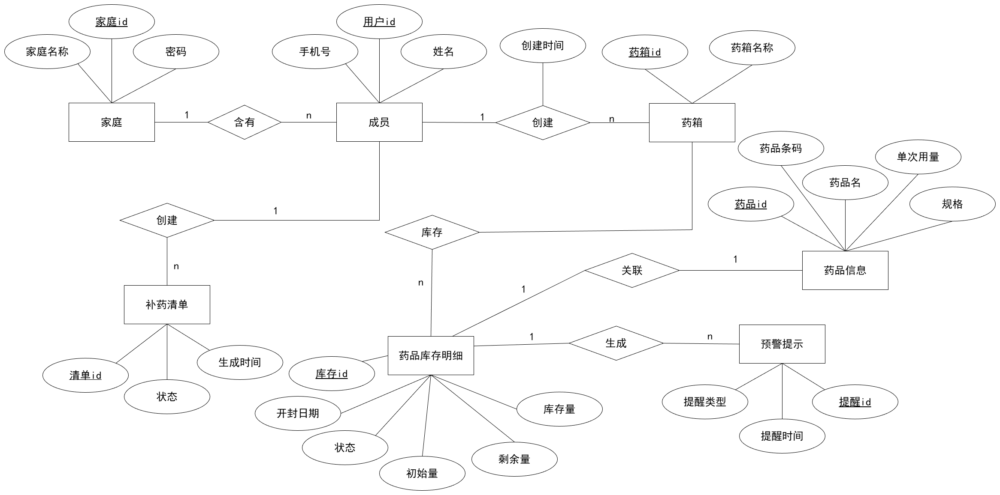

### 表结构设计
> E-R 图转换后共得到 8 张关系表：

| 表名 | 说明 | 属性（字段） |
|------|------|-------------|
| families | 家庭表 | 家庭id、家庭名称、密码 |
| users | 用户表 | 用户id、家庭id、手机号、姓名、创建时间 |
| medicine_boxes | 药箱表 | 药箱id、用户id、药箱名称、创建时间 |
| medicines | 药品信息表 | 药品id、药品条码、药品名、单次用量、规格、创建时间 |
| inventory | 库存表（药品库存明细） | 库存id、药品id、药箱id、初始量、剩余量、开封日期、有效期、状态、创建时间 |
| usage_logs | 用药记录表 | 记录id、库存id、用药剂量、用药时间 |
| restock_list | 补药清单表 | 清单id、库存id、状态、生成时间、完成时间 |
| alerts | 预警提示表 | 提醒id、库存id、提醒类型、提醒时间、状态、是否已读 |

> 建表语句
```sql
-- 家庭表
CREATE TABLE families (
    family_id   SERIAL PRIMARY KEY,
    family_name VARCHAR(50) NOT NULL,
    password    VARCHAR(50) NOT NULL
);

-- 用户表
CREATE TABLE users (
    user_id     SERIAL PRIMARY KEY,
    family_id   INT NOT NULL REFERENCES families(family_id) ON DELETE CASCADE,
    phone       VARCHAR(20) UNIQUE NOT NULL,
    name        VARCHAR(50) NOT NULL,
    created_at  TIMESTAMP DEFAULT CURRENT_TIMESTAMP
);

-- 药箱表
CREATE TABLE medicine_boxes (
    box_id       SERIAL PRIMARY KEY,
    user_id      INT NOT NULL REFERENCES users(user_id) ON DELETE CASCADE,
    box_name     VARCHAR(50) NOT NULL,
    created_at   TIMESTAMP DEFAULT CURRENT_TIMESTAMP
);

-- 药品信息表
CREATE TABLE medicines (
    med_id          SERIAL PRIMARY KEY,
    barcode         VARCHAR(50) UNIQUE,
    name            VARCHAR(100) NOT NULL,
    dosage_per_time DECIMAL(6,2),
    unit            VARCHAR(10) DEFAULT '片',
    spec            VARCHAR(100),
    created_at      TIMESTAMP DEFAULT CURRENT_TIMESTAMP
);

-- 库存表
CREATE TABLE inventory (
    inv_id        SERIAL PRIMARY KEY,
    med_id        INT NOT NULL REFERENCES medicines(med_id),
    box_id        INT NOT NULL REFERENCES medicine_boxes(box_id) ON DELETE CASCADE,
    total_qty     DECIMAL(8,2) NOT NULL CHECK (total_qty > 0),
    remaining_qty DECIMAL(8,2) NOT NULL DEFAULT 0 CHECK (remaining_qty >= 0),
    expiry_date   DATE,
    status        VARCHAR(20) DEFAULT 'normal' CHECK (status IN ('normal', 'expired', 'finished')),
    created_at    TIMESTAMP DEFAULT CURRENT_TIMESTAMP,
    CHECK (remaining_qty <= total_qty)
);

-- 用药记录表
CREATE TABLE usage_logs (
    log_id       SERIAL PRIMARY KEY,
    inv_id       INT NOT NULL REFERENCES inventory(inv_id) ON DELETE CASCADE,
    dose         DECIMAL(6,2) NOT NULL CHECK (dose > 0),
    used_at      TIMESTAMP DEFAULT CURRENT_TIMESTAMP
);

-- 补药清单表
CREATE TABLE restock_list (
    list_id      SERIAL PRIMARY KEY,
    inv_id       INT NOT NULL REFERENCES inventory(inv_id) ON DELETE CASCADE,
    status       VARCHAR(20) DEFAULT 'pending' CHECK (status IN ('pending', 'completed', 'cancelled')),
    generated_at TIMESTAMP DEFAULT CURRENT_TIMESTAMP,
    completed_at TIMESTAMP
);

-- 预警表
CREATE TABLE alerts (
    alert_id     SERIAL PRIMARY KEY,
    inv_id       INT NOT NULL REFERENCES inventory(inv_id) ON DELETE CASCADE,
    alert_type   VARCHAR(20) CHECK (alert_type IN ('near_expiry', 'expired', 'low_stock')),
    remind_time  TIMESTAMP DEFAULT CURRENT_TIMESTAMP,
    status       VARCHAR(20) DEFAULT 'active' CHECK (status IN ('active', 'dismissed', 'resolved')),
    message      VARCHAR(200),
    is_read      BOOLEAN DEFAULT FALSE
);
```

### 核心功能实现
1. 首页数据统计
功能描述：展示系统功能说明和系统核心数据概览，核心数据概览包含药品品种数量，未读预警数量以及待补药品数量，并可以在该页面快速操作进行药品添加，用药记录，查看预警和补药记录。
界面截图：

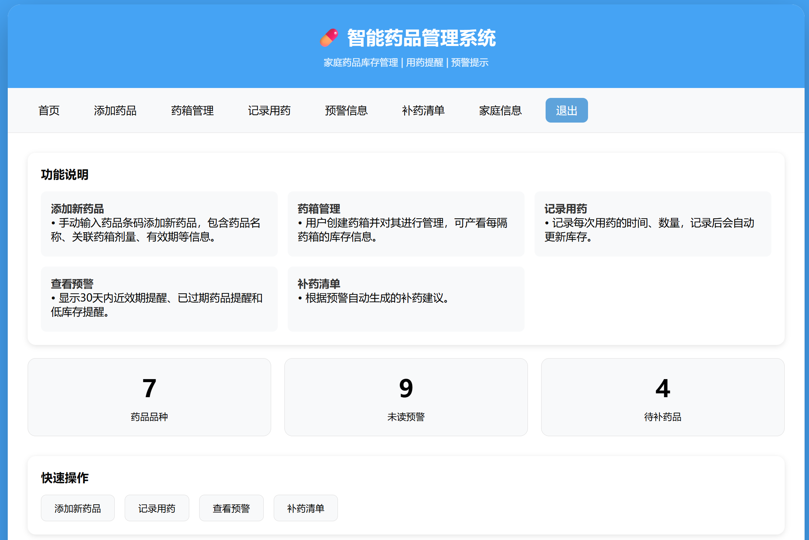
            图 2.1 首页截图
关键 SQL 语句：
```sql
--调用存储过程，遍历所有库存检查过期状态、低库存并生成补药清单和预警信息
SELECT check_all_inventory();

--统计medicines表中的药品总数
SELECT COUNT(*) FROM medicines;	

--统计alerts表中的未读预警总数
SELECT COUNT(*) FROM alerts WHERE is_read = FALSE;

--统计restock_list表中状态为待处理的药品
SELECT COUNT(*) FROM restock_list WHERE status = 'pending';
```

2. 添加药品
功能描述：用户通过手动输入，将新药品添加到指定药箱便于进行药箱管理，同时记录药品名称、单位、单次用量、购入数量和有效期截止日用于生成药品预警提示用户和进行补药清单的整理。
界面截图：

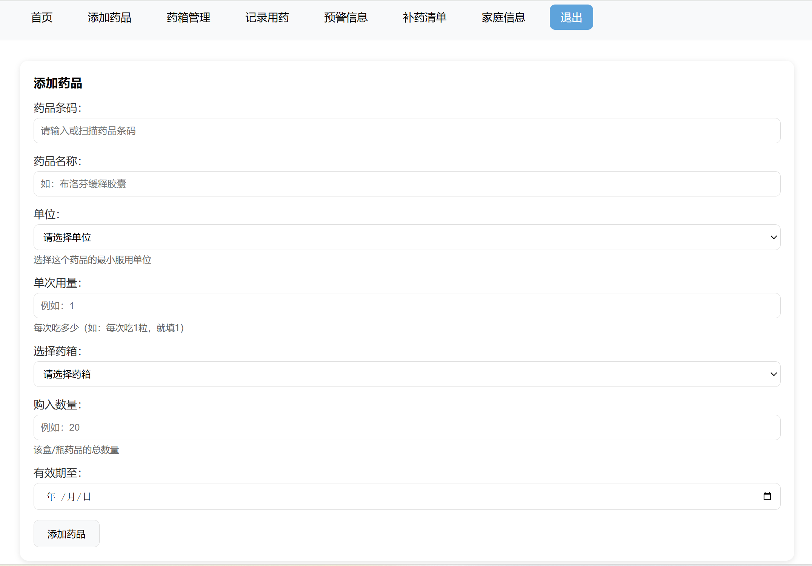
           图 2.2 添加药品界面截图
关键 SQL 语句：
```sql
-- 检查药品是否存在
SELECT med_id FROM medicines WHERE barcode = %s;

--添加新药品信息
INSERT INTO medicines (barcode, name, dosage_per_time, unit) VALUES (%s, %s, %s, %s) RETURNING med_id;

--添加库存信息
INSERT INTO inventory (med_id, box_id, total_qty, remaining_qty, expiry_date, status) VALUES (%s, %s, %s, %s, %s, 'normal') RETURNING inv_id;

--调用存储过程，遍历检查
SELECT check_batch_expiry(%s);
```

3. 药箱管理
功能描述：管理用户的药箱，支持添加新药箱、查看药箱内药品列表、删除药箱和删除药品。添加药箱时可选择已有用户或同步新增用户。
界面截图：

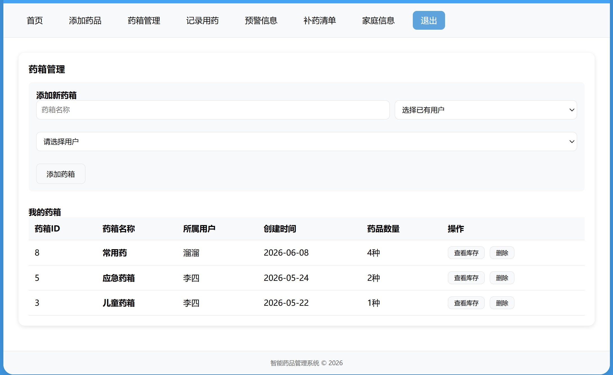
           图 2.3 药箱管理界面截图

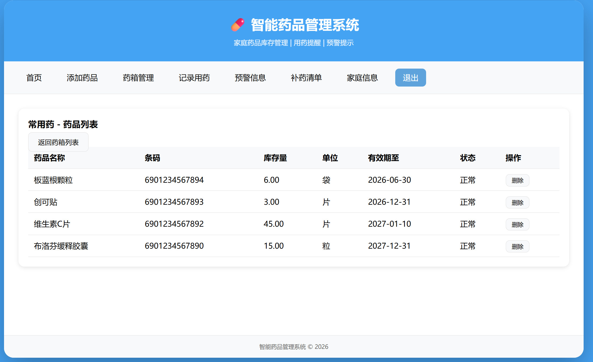
           图 2.4 查看药箱库存截图
关键 SQL 语句：
```sql
--查询用户
SELECT user_id, name, phone FROM users ORDER BY user_id;

--添加新用户：返回用户id关联药箱
INSERT INTO users (phone, name) VALUES (%s, %s) RETURNING user_id;

--查询药箱以及药品：按药箱分组使用左连接统计每个药箱药品数
SELECT b.box_id, b.box_name, u.name, b.created_at, COUNT(i.inv_id)
FROM medicine_boxes b
JOIN users u ON b.user_id = u.user_id
LEFT JOIN inventory i ON b.box_id = i.box_id
GROUP BY b.box_id, b.box_name, u.name, b.created_at
ORDER BY b.created_at DESC;

--添加新药箱
INSERT INTO medicine_boxes (user_id, box_name) VALUES (%s, %s);

--查询药箱中的药品：按有效期排序，即将过期的排在前面
SELECT m.name, m.barcode, i.remaining_qty, m.unit, i.expiry_date, i.status, i.inv_id
from inventory i
JOIN medicines m ON i.med_id = m.med_id
WHERE i.box_id = %s
ORDER BY i.expiry_date;

--删除药箱
DELETE FROM medicine_boxes WHERE box_id = %s;
--删除药品
DELETE FROM inventory WHERE inv_id = %s;
```

4. 用药记录
功能描述：用户记录每次用药情况，系统自动扣减库存、更新药品状态、生成过期预警和低库存预警信息。
界面截图：

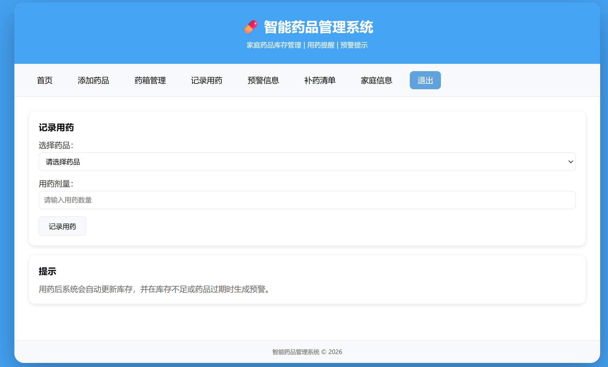
           图 2.5 记录用药界面截图
关键 SQL 语句：
```sql
--查询当前库存量：只显示状态正常且有余量的药品
SELECT i.inv_id, m.name, i.remaining_qty, m.unit, b.box_name 
FROM inventory i 
JOIN medicines m ON i.med_id = m.med_id 
JOIN medicine_boxes b ON i.box_id = b.box_id
WHERE i.status = 'normal' AND i.remaining_qty > 0
ORDER BY b.box_name, m.name;

--更新库存
UPDATE inventory SET remaining_qty = remaining_qty - %s WHERE inv_id = %s;

--记录用药日志
INSERT INTO usage_logs (inv_id, dose) VALUES (%s, %s);

--更新药品状态
UPDATE inventory SET status = 'finished' WHERE inv_id = %s AND remaining_qty <= 0;

--调用过期检查
SELECT check_batch_expiry(%s);
```

5. 智能预警
功能描述：展示系统中所有预警信息，包括已过期预警、30 天内将过期的近效期预警和剩余量小于 10 的低库存预警。
界面截图：

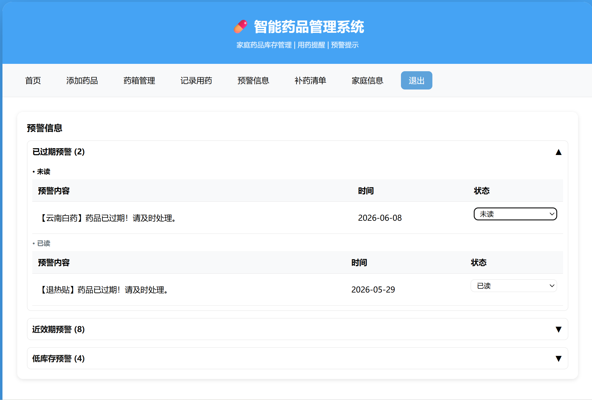
           图 2.6 预警信息界面截图
关键 SQL 语句：
```sql
-- 查询当前家庭的未读预警
SELECT a.alert_type, a.message, a.created_at, a.is_read 
FROM alerts a
Join inventory i ON a.inv_id = i.inv_id
JOIN medicine_boxes b ON i.box_id = b.box_id
JOIN users u ON b.user_id = u.user_id
WHERE u.family_id = 1 AND a.is_read = FALSE;

-- 标记预警为已读
UPDATE alerts SET is_read = TRUE WHERE alert_id = 1;
```

6. 补药清单
功能描述：系统自动生成需要补充的药品清单，用户可将状态更新为 “已完成”。
界面截图：

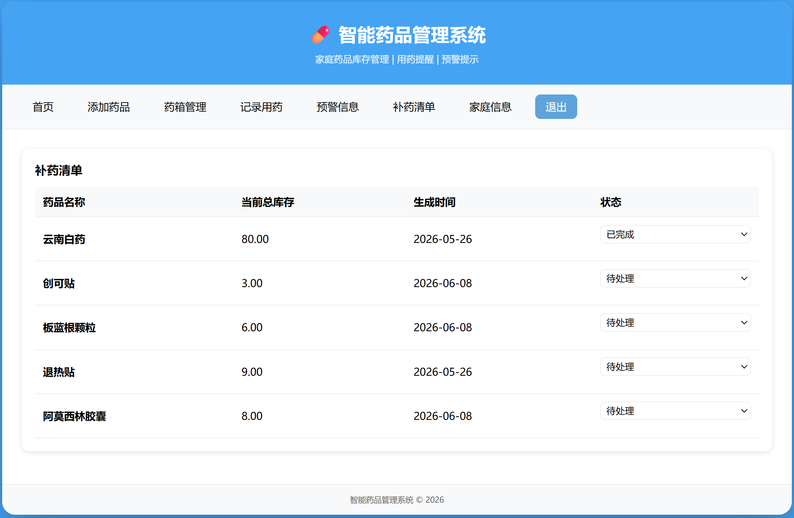
           图 2.7 补药清单界面截图
关键 SQL 语句：
```sql
-- 查看补药清单：按药品分组计算药品总库存，合并多条补药清单记录，根据是否有待处理记录判断整体状态。
SELECT m.name, i.remaining_qty, rl.status, rl.generated_at
FROM restock_list rl
JOIN inventory i ON rl.inv_id = i.inv_id
JOIN medicines m ON i.med_id = m.med_id
WHERE rl.status = 'pending';

-- 更新补药状态
UPDATE restock_list 
SET status = 'completed', completed_at = CURRENT_TIMESTAMP 
WHERE inv_id IN (SELECT inv_id FROM inventory WHERE med_id = 1);
```

7. 家庭管理
功能描述：用户登录或注册家庭账号，登录后只能看到自己家庭的数据。
界面截图：

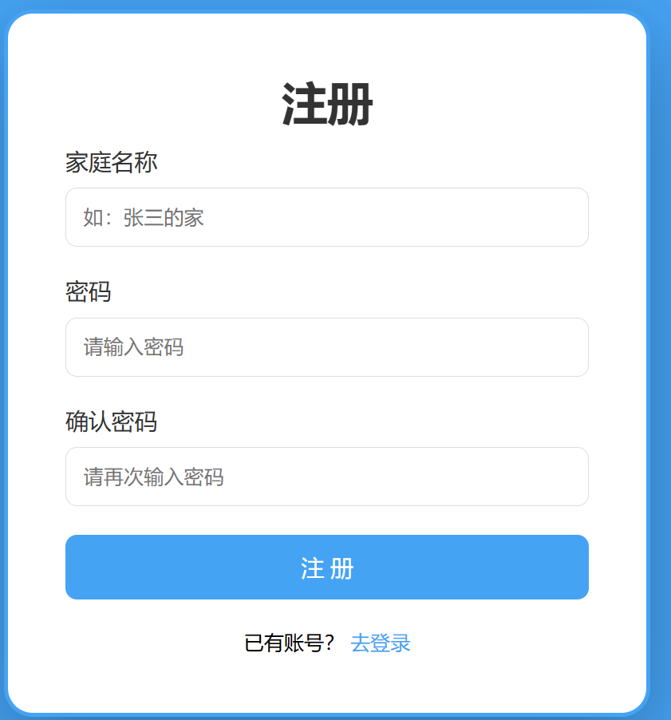
            图 2.8 注册界面截图

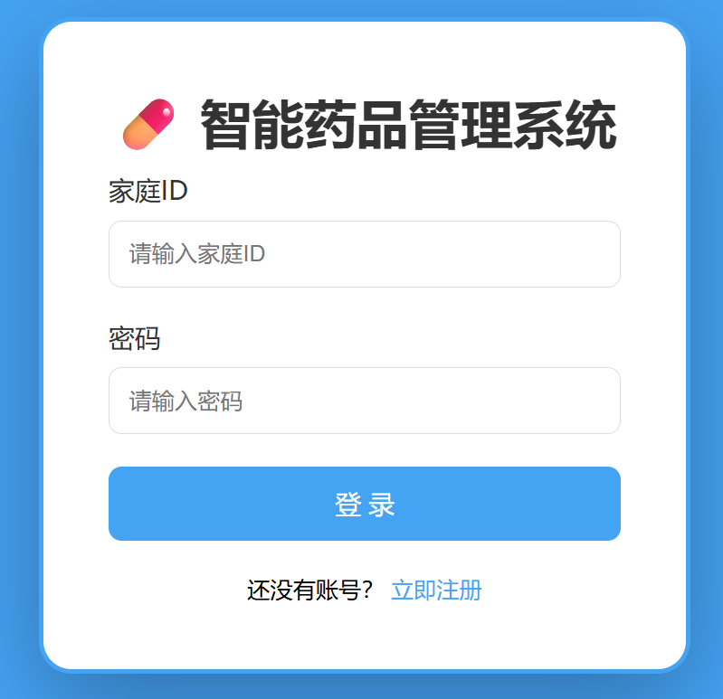
            图 2.9 登录界面截图

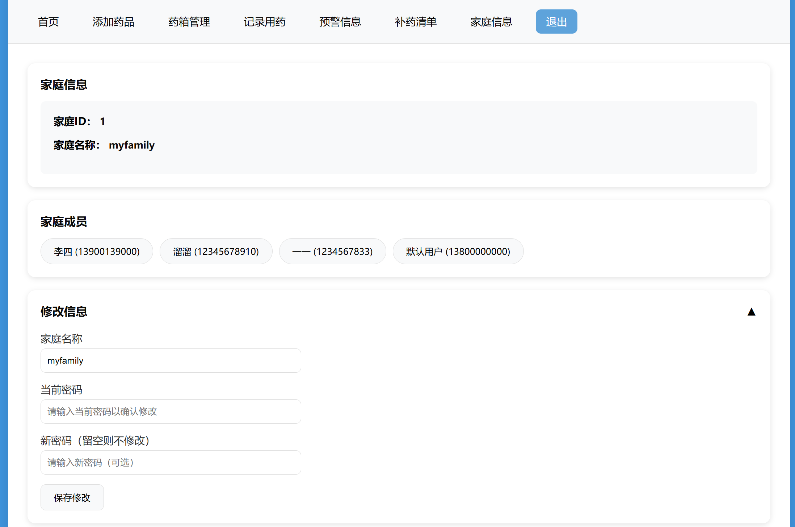
           图 2.10 家庭信息界面截图
关键 SQL 语句：
```sql
-- 注册新家庭
INSERT INTO families (family_name, password) 
VALUES ('张三的家', '123456') RETURNING family_id;

-- 登录验证
SELECT family_id, family_name 
FROM families 
WHERE family_id = 1 AND password = '123456';

-- 获取家庭成员信息
SELECT family_id, family_name, password FROM families WHERE family_id = %s;
SELECT user_id, name, phone FROM users WHERE family_id = %s ORDER BY user_id;

--修改家庭信息
UPDATE families SET family_name = %s WHERE family_id = %s;
UPDATE families SET password = %s WHERE family_id = %s;
```

### 系统优化
#### 索引设计
```sql
-- 药品条码索引，加速药品检索
CREATE INDEX idx_medicines_barcode ON medicines(barcode);
-- 用户家庭索引，实现多家庭数据隔离快速查询
CREATE INDEX idx_users_family ON users(family_id);
-- 库存药箱索引
CREATE INDEX idx_inventory_box ON inventory(box_id);
-- 库存有效期索引，快速筛选近效、过期药品
CREATE INDEX idx_inventory_expiry ON inventory(expiry_date);
-- 预警已读状态索引
CREATE INDEX idx_alerts_read ON alerts(is_read);
-- 补药清单状态索引
CREATE INDEX idx_restock_status ON restock_list(status);
```

#### 性能优化
- 为高频查询字段建立索引，降低多表联查耗时
- 封装存储过程统一批量校验库存，简化业务代码
- 页面数据分页查询，避免一次性加载大批量数据
- Docker 容器独立部署数据库，统一开发运行环境
- 库存变更操作使用事务，保证数据一致性，杜绝脏数据

### 测试用例
#### 功能测试
- 家庭注册、登录、家庭成员增删改查
- 药品录入、多批次库存新增与管理
- 用药提交、库存自动扣减与状态更新
- 近效、过期、低库存预警自动生成
- 补药清单自动生成、状态修改
- 多家庭数据隔离验证（跨家庭不可查看对方药品）
  
#### 性能测试
- 多家庭并发新增药品、提交用药记录并发测试
- 千条库存、预警数据分页查询响应测试
- 存储过程批量校验库存执行效率测试
- Docker 容器下数据库并发连接稳定性测试
  
### AI 交互说明
使⽤的 AI ⼯具：豆包、TraeCN、deepseek

使⽤的 AI ⼯具描述

- 豆包：进行课题的列举，给豆包分析，筛选出可实施且有意义的题目，然后进行需求分析，根据实际需要询问豆包根据痛点能做到什么程度，以及一些 GaussDB 通过 Docker 在本地部署的实施，一些代码报错的询问。

- TraeCN：进行代码的优化，主要是系统前端页面美观优化和代码可读性的优化，让代码结构更简洁。

- DeepSeek：与豆包进行对比，问题一致，结合两个结果选用最好的，另外使用专业模式对系统结构的分析
  
整体工作中合理分工、多工具互补，借助 AI 大幅提升选题、开发、排错与架构分析的效率。本次对 AI 工具属于中度依赖，仅将其作为辅助手段，核心思路、功能设计与最终实现均由小组独立把控、审核完善。

### 项目总结
#### 技术收获
- 掌握完整数据库课程设计全流程：需求分析、E-R 建模、多表逻辑结构设计
- 熟练使用 openGauss、SERIAL 自增主键、CHECK 约束、外键级联操作
- 理解多租户系统数据隔离设计思路，依靠家庭 ID 划分业务数据
- 掌握 Flask Web 开发、Jinja2 模板、前后端数据交互流程
- 学会 Docker 容器化部署数据库，解决数据库远程连接配置问题
- 掌握存储过程、索引、事务，完成系统性能与数据安全优化
  
#### 项目亮点
- 智能触发机制：在访问首页、添加药品和用药记录时会自动调用存储过程更新库存并生成预警提示和补药清单信息。
- Docker 容器化部署：在 Docker 上部署 openGauss，通过端口映射和远程用户配置解决 openGauss 不允许远程连接问题，达到开发环境与实现环境的一致。
药箱分类管理：由于家庭用药对象复杂，本系统可有不同用户创建不同药箱并对其进行独立的有序的分类管理。
- 数据隔离：通过家庭 ID 实现多租户数据隔离，不同家庭的数据互不可见。
   
#### 现存不足
- 在添加药品时不支持扫码输入，需手动输入药品条码，不方便。
补药清单和药品添加未能连接，在补药清单状态从 “待处理” 变成 “已完成” 时可添加相同药品的相关信息。
- 可增加数据可视化，在页面中展示每种药品的用药频率和剂量，并提出相关建议。
   
### 扩展功能
- 增加摄像功能，实现扫码录入。
- 增加数据可视化，对药品的使用频率进行监测。
- 增加数据导出功能，方便用户备份数据。