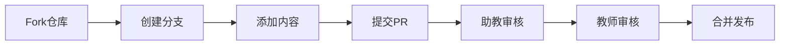

# 数据库课程实验资源平台 - 项目规范与实施计划

## 项目概述

### 项目定位
- **项目名称**: 数据库课程实验资源平台 (dbwiki)
- **项目性质**: 师生共建的数据库实验课程教改项目成果展示平台
- **技术架构**: MkDocs + Material主题 + RAG知识问答（规划中）
- **部署方式**: Vercel静态部署
- **代码管理**: Gitee主仓库 + GitHub镜像

### 核心目标
1. **教学资源共建共享**: 建立标准化的数据库实验教学资源库
2. **质量管控体系**: 建立三级审核机制，确保内容质量
3. **知识问答系统**: 基于RAG技术实现智能问答（后续规划）
4. **教学融合**: 支持翻转课堂和微课教学

---

## 目录结构规范

### 知识库结构 (knowledge_base/)
```
knowledge_base/
├── index.md                    # 平台首页
├── CONTRIBUTING.md            # 贡献指南
├── 1_sql_pitfalls/            # 错误SQL点评
│   ├── syntax_错误类型_作者.md
│   └── logic_错误类型_作者.md
├── 2_enterprise_cases/        # 企业真实案例
│   ├── 行业_案例描述_作者.md
│   └── 行业_案例描述_作者.md
├── 3_avoidance_guides/        # 避坑指南
│   ├── 主题_具体内容_作者.md
│   └── 主题_具体内容_作者.md
├── 4_excellent_labs/          # 优秀实验示范
│   ├── lab编号_实验名称_作者.md
│   └── lab编号_实验名称_作者.md
└── 5_course_designs/          # 课设案例库
    ├── 系统类型_系统名称_作者.md
    └── 系统类型_系统名称_作者.md
```

### 文档命名规范

#### 1. 错误SQL点评 (1_sql_pitfalls/)
- **格式**: `类型_错误描述_作者.md`
- **示例**: 
  - `syntax_groupby错误_teacher.md`
  - `logic_子查询错误_张三.md`
  - `performance_索引缺失_李四.md`

#### 2. 企业案例 (2_enterprise_cases/)
- **格式**: `行业_案例描述_作者.md`
- **示例**:
  - `ecommerce_查询优化_teacher.md`
  - `finance_风控系统_王五.md`
  - `education_选课系统_赵六.md`

#### 3. 避坑指南 (3_avoidance_guides/)
- **格式**: `主题_具体内容_作者.md`
- **示例**:
  - `transaction_死锁避免_teacher.md`
  - `index_索引设计_张三.md`
  - `security_SQL注入_李四.md`

#### 4. 实验示范 (4_excellent_labs/)
- **格式**: `lab编号_实验名称_作者.md`
- **示例**:
  - `lab1_基础查询_student.md`
  - `lab2_复杂查询_张三.md`
  - `lab3_存储过程_李四.md`

#### 5. 课设案例 (5_course_designs/)
- **格式**: `系统类型_系统名称_作者.md`
- **示例**:
  - `library_管理系统_student.md`
  - `hospital_信息管理_张三.md`
  - `shop_电商系统_李四.md`

---

## 元数据标准

### 文档头部元数据格式
每个文档必须在开头包含以下元数据：

```yaml
---
doc_type: [pitfall|enterprise_case|avoidance_guide|lab_demo|course_design]
title: 简明标题
concepts: [概念1, 概念2, 概念3]
difficulty: [0.3|0.6|0.9]  # 0.3=基础, 0.6=中级, 0.9=高级
prerequisites: [先修知识1, 先修知识2]
author: 作者姓名
date: YYYY-MM-DD
tags: [标签1, 标签2, 标签3]
status: [draft|review|approved]  # 草稿|审核中|已批准
---
```

### 元数据字段说明

| 字段 | 必填 | 说明 | 示例 |
|------|------|------|------|
| doc_type | ✅ | 文档类型 | pitfall, enterprise_case, avoidance_guide, lab_demo, course_design |
| title | ✅ | 文档标题 | "GROUP BY子句使用错误" |
| concepts | ✅ | 相关概念 | [group by, 聚合函数, sql错误] |
| difficulty | ✅ | 难度等级 | 0.3, 0.6, 0.9 |
| prerequisites | ❌ | 先修知识 | [基础SQL, 聚合函数] |
| author | ✅ | 作者 | 张三, teacher, 李四 |
| date | ✅ | 创建日期 | 2024-12-19 |
| tags | ❌ | 标签 | [语法错误, 常见问题] |
| status | ❌ | 状态 | draft, review, approved |

---

## 内容质量标准

### 1. 错误SQL点评标准
- **错误代码**: 提供真实的错误SQL示例
- **正确代码**: 提供修正后的正确SQL
- **错误分析**: 详细说明错误原因
- **学习要点**: 总结关键知识点
- **扩展思考**: 提供相关练习题

### 2. 企业案例标准
- **业务背景**: 清晰描述业务场景
- **技术挑战**: 说明面临的技术问题
- **解决方案**: 详细的技术解决方案
- **效果评估**: 量化的改进效果
- **经验总结**: 可复用的经验教训

### 3. 避坑指南标准
- **问题描述**: 清晰描述常见问题
- **原因分析**: 深入分析问题根因
- **预防措施**: 具体的预防方法
- **最佳实践**: 推荐的最佳实践
- **工具推荐**: 相关工具和方法

---

## 协作流程

### 1. 提交流程


### 2. 三级审核机制

#### 第一级：学生自检
- [ ] 文件命名符合规范
- [ ] 元数据完整填写
- [ ] 内容结构清晰
- [ ] SQL语法正确
- [ ] 无抄袭问题

#### 第二级：助教审核
- [ ] 技术内容准确性
- [ ] 文档格式规范
- [ ] 代码可执行性
- [ ] 学习价值评估

#### 第三级：教师审核
- [ ] 教学价值评估
- [ ] 学术正确性
- [ ] 内容创新性
- [ ] 最终质量确认

---

## 技术实现

### 1. 同步机制
- **源目录**: `knowledge_base/` (师生协作编辑)
- **目标目录**: `docs/` (MkDocs构建)
- **同步脚本**: `scripts/sync_docs.py`
- **自动化**: 通过GitHub Actions实现自动同步

### 2. 构建流程
```bash
# 1. 同步内容
python scripts/sync_docs.py

# 2. 构建网站
mkdocs build --clean

# 3. 部署到Vercel
# (自动触发)
```

### 3. 质量检查
- **元数据检查**: 验证文档头部元数据完整性
- **语法检查**: 检查Markdown和SQL语法
- **链接检查**: 验证内部链接有效性
- **重复检查**: 检测内容重复度

---

## 后续规划

### 短期目标 (1-2个月)
- [ ] 完善现有内容结构
- [ ] 建立学生协作机制
- [ ] 实施三级审核流程
- [ ] 优化同步脚本功能

### 中期目标 (3-6个月)
- [ ] 开发RAG知识问答系统
- [ ] 建立内容质量评估体系
- [ ] 实现自动化内容检查
- [ ] 开发移动端适配

### 长期目标 (6-12个月)
- [ ] 建立多校协作机制
- [ ] 开发智能推荐系统
- [ ] 建立学习路径规划
- [ ] 实现多语言支持

---

## 维护指南

### 日常维护
1. **内容更新**: 定期更新和补充教学内容
2. **质量监控**: 持续监控内容质量和用户反馈
3. **技术维护**: 保持技术栈的更新和安全性
4. **用户支持**: 及时响应用户问题和建议

### 版本管理
- **主版本**: 重大功能更新
- **次版本**: 新内容添加
- **修订版本**: 错误修复和小改进

---

## 严格构建与发布指南

本节为必须遵守的构建与发布流程，任何合并到主分支的内容都需要严格按以下步骤执行。

### 1. 分支与提交规范
- 使用 Conventional Commits：`type(scope): summary`
  - 例如：`docs(knowledge_base): 新增触发器案例并完善元数据`
  - 构建产物使用：`build(site): 重新构建静态站点`
- 一次提交只做一类改动：内容编辑、配置修改、构建产物分开提交。

### 2. 文档校验清单（必须全部通过）
- [ ] 文件命名符合目录规范（见“目录结构规范-文档命名规范”）
- [ ] 顶部元数据完整，至少包含：`doc_type/title/concepts/difficulty/author/date`
- [ ] SQL 代码块使用 ```sql 语言标注
- [ ] 小节层级为 `# 文档标题` → `## 一级小节` → `### 二级小节`
- [ ] 图片与外链可访问

### 3. 同步与构建步骤
```bash
# 1) 同步知识库到 docs（会进行命名与元数据校验）
python3 scripts/sync_docs.py

# 2) 本地预览（可选）
mkdocs serve

# 3) 生成静态站点
mkdocs build --clean
```

### 4. 导航（mkdocs.yml）更新要求
- 新增页面必须加入 `nav`，放在对应分类下，中文标题与文件路径保持一致。
- 示例：
```yaml
nav:
  - 实验示范:
    - 基础查询: 4_excellent_labs/lab1_基础查询_student.md
    - 触发器与存储过程：教材案例的MySQL实现: 4_excellent_labs/触发器与存储过程教材案例MySQL实现.md
```

### 5. 提交与推送
```bash
# 提交内容改动
git add knowledge_base/ docs/ mkdocs.yml
git commit -m "docs(knowledge_base): 标准化元数据并新增触发器案例"

# 提交构建产物（若需静态托管，可强制加入 site）
git add -f site
git commit -m "build(site): 更新 MkDocs 构建产物"

git push origin main
```

> 注意：`site/` 目录通常在 `.gitignore` 中被忽略；若依赖 gitee Pages/静态托管，需要纳入版本控制。

### 6. 常见问题
- 构建成功但导航缺页：检查 `mkdocs.yml` 的 `nav` 是否加入新文档路径。
- 同步后校验警告：按脚本提示修正命名或元数据后重新运行同步。
- 站点链接 404：确认目标文档确实存在于 `docs/`，且路径与导航一致。

---

*最后更新：2025-11-04*
*维护者：kidzying*
*版本：v1.1*
